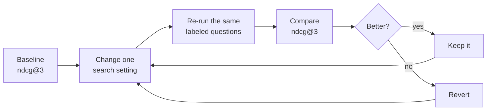

# Improving retrieval quality

When a GPT-RAG answer is vague, incomplete, or not grounded in your documents,
the cause is usually retrieval: the agent answered from the wrong chunks. Better
prompts and bigger models cannot fix a bad set of retrieved chunks. The fix is to
measure retrieval quality directly and tune the search settings until the right
chunks come back at the top.

This guide takes you from zero to a working optimization loop. You will:

1. Pull the chunks your index returns for a few real questions.
2. Label which chunks are actually relevant (this is your ground truth).
3. Score the ranking with the Foundry
   [Document Retrieval evaluator](https://learn.microsoft.com/azure/ai-foundry/concepts/evaluation-evaluators/rag-evaluators#document-retrieval),
   which returns ranking metrics like NDCG.
4. Change one GPT-RAG search setting at a time and re-measure until the numbers go up.
5. Watch the whole loop move a real number on one worked example.

No prior evaluation experience is needed. Everything runs from a small Python
script against your own search index.

## How retrieval works

GPT-RAG stores every document as small chunks in an Azure AI Search index named
`ragindex`. At query time the orchestrator embeds the user question, runs a search
against that index, and passes the top chunks to the model as context. The
behavior is controlled by settings in **Azure App Configuration** (label
`gpt-rag`). These are the levers you will tune:

| Setting (App Configuration, label `gpt-rag`) | Default | What it controls |
|---|---|---|
| `SEARCH_RAG_INDEX_NAME` | `ragindex` | The index that holds your chunks. |
| `SEARCH_APPROACH` | `hybrid` | How search runs: `term` (keyword only), `vector` (embeddings only), or `hybrid` (both). |
| `SEARCH_RAGINDEX_TOP_K` | `3` | How many chunks are retrieved and sent to the model. |
| `SEARCH_USE_SEMANTIC` | `false` | Turns the Azure AI Search semantic reranker on or off. |
| `SEARCH_SEMANTIC_SEARCH_CONFIG` | `my-semantic-config` | The semantic ranker configuration name. |
| `CHUNKING_NUM_TOKENS` | `2048` | Maximum chunk size in tokens (set in ingestion, applied when you re-ingest). |
| `TOKEN_OVERLAP` | `200` | Token overlap between consecutive chunks (ingestion). |

The first four are query-time settings: change them and the next question uses the
new behavior. The chunking settings are ingestion-time: changing them only takes
effect after you re-ingest your documents, which rebuilds the index.

## Measure, do not guess

GPT-RAG already ships an evaluation harness in the orchestrator (the
`evaluations/` folder of `gpt-rag-orchestrator`) that runs Foundry's built-in
evaluators against your golden dataset: **Relevance**, **Retrieval**,
**Completeness**, and **Content Safety**. The two that speak to retrieval,
**Relevance** and **Retrieval**, use an LLM judge and a 1 to 5 score, need no
labels, and are cheap to run on every change, so they tell you *that* retrieval is
weak. What they do not do is tell you *how to fix it* or let you compare two search
configurations objectively.

Document Retrieval is the tuning tool. You give it two things per question:

- **The retrieved documents**: the ranked list your index returned, each with the
  retriever's own score.
- **The relevance labels (qrels)**: your own judgment of how relevant each chunk
  truly is, on a 0 to 4 scale.

It then compares the ranking the retriever produced against the ranking your labels
imply, and returns position-aware metrics. If the most relevant chunks are at the
top, the scores are high. If relevant chunks are buried or missing, the scores drop.

!!! note "Why this is a tuning tool, not a CI gate"
    Document Retrieval needs hand-labeled ground truth, and its labels reference
    specific chunk ids in your current index. Rebuilding the index can change those
    ids and invalidate the labels. That is fine for a deliberate tuning study, but
    too brittle to run on every commit. Keep Relevance and Retrieval on your
    automated checks, and use Document Retrieval here, on demand, when you decide to
    improve search.

## Before you start

You need:

- **Python 3.10 or later.**
- **The Python packages:**

    ```bash
    pip install azure-search-documents azure-identity openai azure-ai-evaluation
    ```

- **Access to your deployed resources.** Sign in with the Azure CLI using an
  identity that can read the search index and call Azure OpenAI:

    ```bash
    az login
    ```

    Your identity needs two role assignments:

    - **Search Index Data Reader** on the Azure AI Search service (to read chunks).
    - **Cognitive Services OpenAI User** on the Azure OpenAI resource (to embed the query).

- **A few values from your environment.** Open Azure App Configuration (label
  `gpt-rag`) or the Azure portal and collect:

    | Value | Where to find it |
    |---|---|
    | Search endpoint | `SEARCH_SERVICE_QUERY_ENDPOINT`, e.g. `https://<your-search>.search.windows.net` |
    | Index name | `SEARCH_RAG_INDEX_NAME` (usually `ragindex`) |
    | Azure OpenAI endpoint | Your Azure OpenAI resource endpoint, e.g. `https://<your-aoai>.openai.azure.com` |
    | Embedding deployment | `EMBEDDING_DEPLOYMENT_NAME`, e.g. `text-embedding-3-large` |

Set them as environment variables so the scripts below can read them:

```bash
export SEARCH_ENDPOINT="https://<your-search>.search.windows.net"
export INDEX_NAME="ragindex"
export AOAI_ENDPOINT="https://<your-aoai>.openai.azure.com"
export EMBED_DEPLOYMENT="text-embedding-3-large"
```

On Windows PowerShell use `$env:SEARCH_ENDPOINT = "..."` instead of `export`.

## Step 1: pick questions

Pick a small set of questions that real users ask and that your documents should
answer. Five to fifteen is plenty to start. A small, trusted set is far easier to
label and reason about than a large noisy one.

```text
How is fuel pressure maintained in the fuel delivery system?
What is the function of the fuel pressure regulator?
When should the fuel filter be replaced?
```

Save them in a file `questions.txt`, one per line.

!!! tip "Want a ready-made example to follow along?"
    Download this sample document and use it as your test corpus:
    [vw-fuel-system.pdf](assets/vw-fuel-system.pdf) (a short technical manual about
    an automotive fuel system). Ingest it into GPT-RAG the same way you ingest any
    document (drop it in the `documents` container of your storage account, or use
    the ingestion path you configured), wait for indexing to finish, then run the
    three questions above. After ingestion its chunks appear in `ragindex` with ids
    like `documents-vw-fuel-system-pdf-c00002`. The walkthrough below uses those
    ids so you can reproduce every step end to end.

## Step 2: pull results

This script runs the same kind of search the GPT-RAG orchestrator runs (hybrid by
default) and prints the ranked chunks for each question, including a content
preview so you can judge relevance. It also saves the raw results to
`retrieved.json` for the next steps.

```python
# retrieve.py
import json, os
from azure.identity import DefaultAzureCredential, get_bearer_token_provider
from azure.search.documents import SearchClient
from azure.search.documents.models import VectorizedQuery
from openai import AzureOpenAI

SEARCH_ENDPOINT  = os.environ["SEARCH_ENDPOINT"]
INDEX_NAME       = os.environ.get("INDEX_NAME", "ragindex")
AOAI_ENDPOINT    = os.environ["AOAI_ENDPOINT"]
EMBED_DEPLOYMENT = os.environ["EMBED_DEPLOYMENT"]

# The four levers you will sweep in Step 6. Start with the GPT-RAG defaults.
TOP_K           = int(os.environ.get("TOP_K", "3"))          # SEARCH_RAGINDEX_TOP_K
APPROACH        = os.environ.get("APPROACH", "hybrid")        # term | vector | hybrid
USE_SEMANTIC    = os.environ.get("USE_SEMANTIC", "false").lower() == "true"
SEMANTIC_CONFIG = os.environ.get("SEMANTIC_CONFIG", "my-semantic-config")

credential = DefaultAzureCredential()
token_provider = get_bearer_token_provider(
    credential, "https://cognitiveservices.azure.com/.default"
)
aoai = AzureOpenAI(
    azure_endpoint=AOAI_ENDPOINT,
    azure_ad_token_provider=token_provider,
    api_version="2024-10-21",
)
search = SearchClient(SEARCH_ENDPOINT, INDEX_NAME, credential)


def embed(text):
    return aoai.embeddings.create(input=[text], model=EMBED_DEPLOYMENT).data[0].embedding


def retrieve(query):
    kwargs = {"select": ["id", "title", "filepath", "content"], "top": TOP_K}
    if APPROACH in ("vector", "hybrid"):
        kwargs["vector_queries"] = [
            VectorizedQuery(vector=embed(query), k_nearest_neighbors=TOP_K, fields="contentVector")
        ]
    if APPROACH in ("term", "hybrid"):
        kwargs["search_text"] = query
    if USE_SEMANTIC:
        kwargs["query_type"] = "semantic"
        kwargs["semantic_configuration_name"] = SEMANTIC_CONFIG

    docs = []
    for r in search.search(**kwargs):
        score = r["@search.reranker_score"] if USE_SEMANTIC else r["@search.score"]
        docs.append({
            "document_id": r["id"],            # the index key, e.g. documents-vw-fuel-system-pdf-c00002
            "relevance_score": score,          # the retriever's own ranking score
            "title": r.get("title"),
            "filepath": r.get("filepath"),
            "preview": (r.get("content") or "")[:300],
        })
    return docs


questions = [q.strip() for q in open("questions.txt", encoding="utf-8") if q.strip()]
out = {}
for q in questions:
    docs = retrieve(q)
    out[q] = docs
    print(f"\n=== {q}")
    for i, d in enumerate(docs, 1):
        print(f"  {i}. [{d['relevance_score']:.3f}] {d['document_id']}")
        print(f"     {d['preview']}")

json.dump(out, open("retrieved.json", "w", encoding="utf-8"), indent=2, ensure_ascii=False)
print("\nSaved retrieved.json")
```

Run it:

```bash
python retrieve.py
```

Each chunk's `document_id` is the index key (for example
`documents-vw-fuel-system-pdf-c00002`), built from the source file path plus the
chunk number. That is the id you will label in the next step.

!!! tip "The orchestrator and the evaluator name fields differently"
    Azure AI Search returns each chunk as `id` and `@search.score`. The Document
    Retrieval evaluator expects `document_id` and `relevance_score`. The script
    above already does that mapping for you. `relevance_score` is the retriever's
    own confidence used to rank. The label you add next is *your* judgment of true
    relevance.

## Step 3: label results

For each question, read the previews in `retrieved.json` and decide how relevant
each chunk really is, from 0 (irrelevant) to 4 (perfect answer). This is the
ground truth the evaluator compares against. You only label the chunks that matter
for the question, not the whole index.

A simple rubric works well:

| Label | Meaning |
|---|---|
| `4` | Directly and fully answers the question. |
| `3` | Strongly relevant, contains most of the answer. |
| `2` | Partially relevant, touches the topic. |
| `1` | Weakly related, mentions the topic in passing. |
| `0` | Not relevant. |

Save your labels in `qrels.json`, keyed by the same question text:

```json
{
  "How is fuel pressure maintained in the fuel delivery system?": [
    { "document_id": "documents-vw-fuel-system-pdf-c00002", "query_relevance_label": 4 },
    { "document_id": "documents-vw-fuel-system-pdf-c00001", "query_relevance_label": 2 },
    { "document_id": "documents-vw-fuel-system-pdf-c00007", "query_relevance_label": 0 }
  ]
}
```

!!! tip "Keep qrels small and stable"
    A handful of carefully labeled questions beats a large, sloppy set. Store the
    labels next to your question file and treat them as ground truth you maintain.
    Because the ids are tied to your current index, re-check the labels after any
    re-ingestion or chunking change (see the reindex note below).

## Step 4: score the ranking

This script loads the retrieved chunks and your labels, runs the Document
Retrieval evaluator once per question, and prints the metrics.

```python
# evaluate.py
import json
from azure.ai.evaluation import DocumentRetrievalEvaluator

retrieved = json.load(open("retrieved.json", encoding="utf-8"))
qrels = json.load(open("qrels.json", encoding="utf-8"))

evaluator = DocumentRetrievalEvaluator(
    ground_truth_label_min=0,
    ground_truth_label_max=4,
)

for question, labels in qrels.items():
    docs = retrieved.get(question, [])
    # The evaluator only needs document_id and relevance_score.
    retrieved_documents = [
        {"document_id": d["document_id"], "relevance_score": d["relevance_score"]}
        for d in docs
    ]
    result = evaluator(
        retrieval_ground_truth=labels,
        retrieved_documents=retrieved_documents,
    )
    print(f"\n=== {question}")
    for key in ["ndcg@3", "xdcg@3", "fidelity", "top1_relevance", "top3_max_relevance", "holes", "holes_ratio"]:
        if key in result:
            print(f"  {key:20s} {result[key]}")
```

Run it:

```bash
python evaluate.py
```

## Step 5: read the metrics

Document Retrieval returns a set of ranking metrics, not a single pass or fail. These
are the ones you will use most.

| Metric | What it tells you | Direction |
|---|---|---|
| `ndcg@3` | Ranking quality in the top 3, rewarding relevant chunks near the top. This is your headline number. | higher is better |
| `xdcg@3` | Like NDCG but weights the very top results more heavily. | higher is better |
| `fidelity` | How much of the truly relevant set the retriever managed to surface. | higher is better |
| `top1_relevance` | The label of the single best-ranked chunk. | higher is better |
| `top3_max_relevance` | The best label found anywhere in the top 3. | higher is better |
| `holes` | Retrieved chunks you never labeled. A sign your qrels are incomplete. | lower is better |
| `holes_ratio` | Holes as a fraction of retrieved chunks. | lower is better |

How to read them in practice:

- **Pick `ndcg@3` as the number you optimize.** A value near `1.0` means the most
  relevant chunks are arriving at the top. A low value means relevant chunks exist
  but are ranked poorly, or the right chunks are not coming back at all.
- **Watch `holes_ratio`.** If it climbs, the retriever is returning chunks your
  labels do not cover. Either your labels are incomplete, or the index changed and
  your qrels need a refresh.
- **Average across your questions.** Look at the mean `ndcg@3` over the whole set,
  not a single question, so one odd query does not mislead you.

## Step 6: optimization loop

Now use the numbers to tune search. Change one thing, re-run the same labeled
questions, and compare the headline metric. Keep changes that raise `ndcg@3`
without inflating `holes_ratio`; revert the rest.



**Tune offline first, then promote the winner.** You do not have to redeploy
GPT-RAG to test an idea. The `retrieve.py` script reads `TOP_K`, `APPROACH`,
`USE_SEMANTIC`, and `SEMANTIC_CONFIG` from environment variables, so you can sweep
them locally against the live index in seconds. Once you find a setting that wins,
set the matching App Configuration key (label `gpt-rag`) so production uses it.

```bash
# Try keyword-only vs vector-only vs hybrid, top-3 vs top-5, reranker on vs off.
APPROACH=hybrid TOP_K=3 python retrieve.py && python evaluate.py
APPROACH=hybrid TOP_K=5 python retrieve.py && python evaluate.py
APPROACH=hybrid TOP_K=5 USE_SEMANTIC=true python retrieve.py && python evaluate.py
```

What to sweep, and the GPT-RAG setting each one maps to:

| Lever | In the script | In GPT-RAG (App Configuration, label `gpt-rag`) | Needs re-ingestion? |
|---|---|---|---|
| How many chunks are retrieved | `TOP_K` | `SEARCH_RAGINDEX_TOP_K` | No |
| Search mode (keyword, vector, hybrid) | `APPROACH` | `SEARCH_APPROACH` | No |
| Semantic reranker on/off | `USE_SEMANTIC` | `SEARCH_USE_SEMANTIC` | No |
| Chunk size and overlap | not in the script | `CHUNKING_NUM_TOKENS`, `TOKEN_OVERLAP` | Yes |

Practical guidance:

- **Start with search mode and the reranker.** Hybrid plus the semantic reranker is
  usually the strongest combination, at slightly higher query cost. If you are on
  keyword or vector only, try hybrid first.
- **Then tune top-k.** Too few chunks miss relevant context; too many dilute it with
  noise and cost more tokens. Sweep 3, 5, and 8 and watch where `ndcg@3` peaks.
- **Change chunking last.** Bigger chunks keep more context together but match less
  precisely; smaller chunks match precisely but can fragment an answer. This is the
  most expensive lever because it requires re-ingesting your documents, which
  rebuilds the index and changes chunk ids, so you must re-verify your qrels
  afterward.

When you are done, the improvement should show up downstream too. Better ranking
feeds better context, so the LLM-judge **Relevance** and **Retrieval** scores
should rise as well. That is the loop closing: you tune retrieval here, and confirm
the gain in your normal evaluation.

## Step 7: prove the gain

Theory is nice, but you want to watch the loop actually move a number. Here is the
same fuel-system question worked end to end, changing exactly one lever: the
semantic reranker. The commands are the ones from Step 6, run twice.

```bash
# Baseline: hybrid search, reranker off (the GPT-RAG default).
APPROACH=hybrid TOP_K=3 python retrieve.py && python evaluate.py

# One change: turn on the semantic reranker.
APPROACH=hybrid TOP_K=3 USE_SEMANTIC=true python retrieve.py && python evaluate.py
```

Take the headline question, "How is fuel pressure maintained in the fuel delivery
system?" In Step 3 you labeled three chunks for it:

| Chunk id | Your label (0-4) |
|---|---|
| `documents-vw-fuel-system-pdf-c00002` | 4 (answers it directly) |
| `documents-vw-fuel-system-pdf-c00001` | 2 (related background) |
| `documents-vw-fuel-system-pdf-c00007` | 0 (off topic) |

Now look at the order each run returns for that one question:

- **Baseline (reranker off):** `c00001` (2), `c00007` (0), `c00002` (4). The chunk
  that actually answers the question came back third, behind a weaker one.
- **Reranker on:** `c00002` (4), `c00001` (2), `c00007` (0). The best chunk is now
  first.

The labels did not change, only the order did. That is exactly what `ndcg@3` is
built to catch:

| Setting | This question `ndcg@3` | Mean `ndcg@3` (all questions) | Mean `holes_ratio` |
|---|---|---|---|
| Baseline (hybrid, reranker off) | 0.62 | 0.63 | 0.00 |
| Reranker on | 1.00 | 0.94 | 0.00 |

Your exact decimals will differ; what matters is the direction and the size of the
move. The mean `ndcg@3` jumped from `0.63` to `0.94` while `holes_ratio` stayed at
`0.00`, so the reranker is a clean win: better ranking, and no new unlabeled chunks
leaking in. If `holes_ratio` had climbed instead, you would pause and check whether
your labels were simply incomplete before trusting the gain.

> **Knowledge nugget: why the reranker moved the right chunk up.** Plain hybrid
> search scores each chunk on lexical overlap plus vector similarity, and it scores
> each chunk in isolation. The semantic reranker adds a second pass: a cross-encoder
> model reads the query and each candidate chunk together and re-scores them by how
> well the passage answers the question. Chunk `c00002` explains how the regulator
> holds rail pressure, which is squarely on topic even though it shares fewer exact
> words with the query, so the reranker lifts it above the lexically similar but less
> useful `c00001`. That is why turning the reranker on is usually the first lever to
> try.

Now promote the winner. The setting that won locally is `USE_SEMANTIC=true`, which
maps to the App Configuration key `SEARCH_USE_SEMANTIC` (label `gpt-rag`). Set it to
`true` so production retrieval uses the configuration you just validated, then re-run
your normal evaluation to confirm the LLM-judge **Relevance** and **Retrieval**
scores rise too. That is one full turn of the loop: a change you measured, proved,
and shipped.

## After re-ingesting

Re-ingestion (for example after changing `CHUNKING_NUM_TOKENS`) rebuilds the index
and assigns new chunk ids. Your old `qrels.json` points at ids that may no longer
exist, so its labels become stale. After any re-ingestion:

1. Re-run `retrieve.py` to get the new chunk ids.
2. Re-label the new chunks in `qrels.json`.
3. Re-run `evaluate.py` to compare against your previous baseline.

This is why the labeled set is kept small: re-labeling a handful of questions is
quick; re-labeling hundreds is not.

## Tips and caveats

- **Labels are index-specific.** The `document_id` values are chunk ids from your
  current index. Re-author or re-verify qrels after re-ingesting or changing chunking.
- **Keep the labeled set focused.** This is a diagnostic and tuning surface, not a
  regression suite. A small, trusted set of questions is easier to maintain and
  reason about.
- **It complements, it does not replace, your evaluation gate.** Relevance and
  Retrieval stay on your automated checks. Document Retrieval is the deeper look you
  reach for when those scores say retrieval is the problem.
- **The semantic reranker has a cost.** It improves ranking but adds latency and is
  billed per query. Confirm the `ndcg@3` gain is worth it before enabling it in
  production.

## Related

- [Foundry RAG evaluators](https://learn.microsoft.com/azure/ai-foundry/concepts/evaluation-evaluators/rag-evaluators): the full evaluator reference, including every Document Retrieval score key.
- [Evaluate with the Azure AI Evaluation SDK](https://learn.microsoft.com/azure/ai-foundry/how-to/develop/evaluate-sdk): how the evaluator runs in code.
- [Hybrid search in Azure AI Search](https://learn.microsoft.com/azure/search/hybrid-search-overview): how keyword and vector search combine.
- [Semantic ranking in Azure AI Search](https://learn.microsoft.com/azure/search/semantic-search-overview): what the reranker does.
- [Relevance and scoring](https://learn.microsoft.com/azure/search/hybrid-search-ranking): how results are scored and fused.
- [Ingestion](services_ingestion.md): how documents are chunked and indexed in GPT-RAG.
- [Orchestrator](services_orchestrator.md): how retrieved chunks become an answer.
