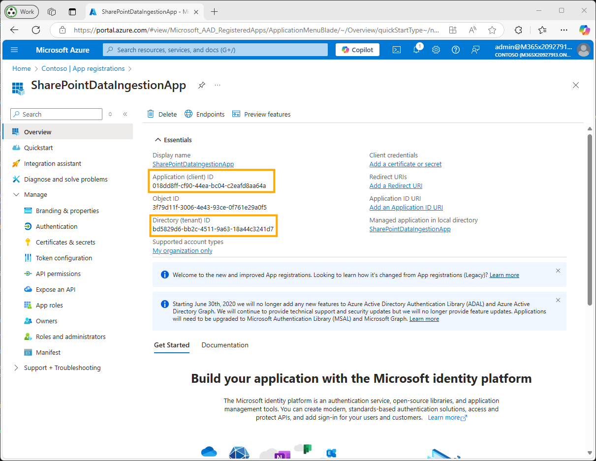
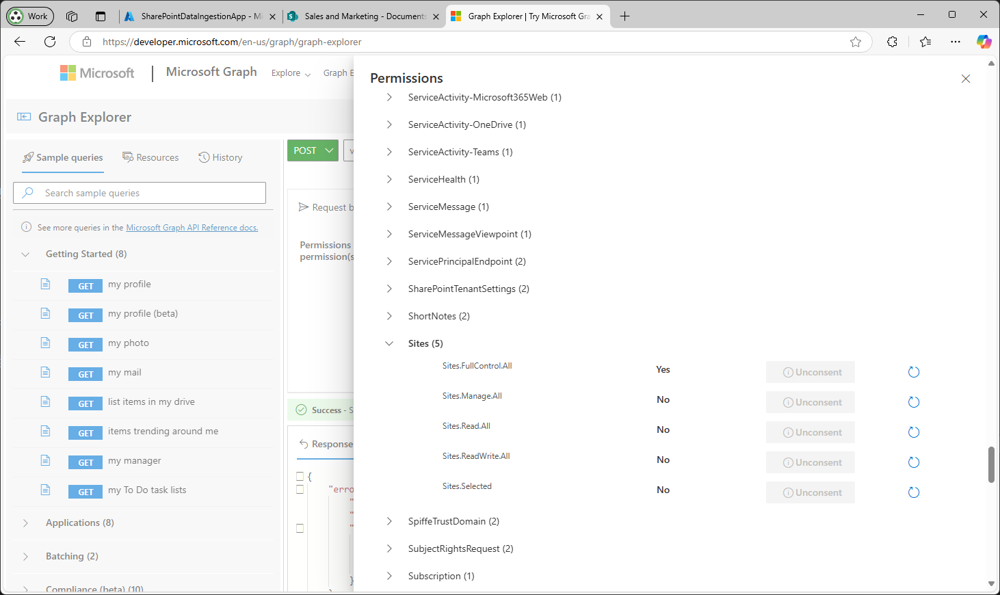

# SharePoint Setup (Preview Release)

This section explains how to configure SharePoint as a data source for the GPT-RAG Azure AI Search Index, using the `Sites.Selected` permission to limit access to specific site collections.

The configuration process involves the following steps:

1. **[Exploring SharePoint with Graph API](#exploring-sharepoint-with-graph-api)**: Navigate and discover SharePoint site information using Microsoft Graph API.
2. **[App Registration](#app-registration)**: Create an Azure Entra ID application to enable the solution to connect to SharePoint via Graph API.
3. **[Ingestion Job](#ingestion-job)**: Configure the data sources to define which SharePoint sites, lists, and drives will be indexed.
4. **[Run Job](#run-ingestion-job)**: Enable and schedule the ingestion jobs using CRON expressions in App Configuration.
5. **[Validation](#validation)**: Test and verify that the SharePoint content is being successfully indexed.


> 
> Using `Sites.Selected` ensures that your application only has access to the SharePoint sites you've explicitly granted permissions to, enhancing security by limiting access scope

## Exploring SharePoint with Graph API

Before configuring the ingestion job, you need to understand your SharePoint site structure. This section shows you how to use Microsoft Graph API to discover site information, lists, columns, items, and permissions.

**Prerequisites**

- Access to [Microsoft Graph Explorer](https://developer.microsoft.com/graph/graph-explorer)
- A user account with access to the SharePoint site you want to explore
- Basic understanding of your SharePoint site URL structure

**Understanding SharePoint Site URLs**

A typical SharePoint site URL follows this pattern:

```
https://{siteDomain}/sites/{siteName}
```

For example: `https://contoso.sharepoint.com/sites/SalesAndMarketing`

- **siteDomain**: `contoso.sharepoint.com`
- **siteName**: `SalesAndMarketing`

**1. Get Site Information**

Retrieve basic information about your SharePoint site, including the site ID which you'll need for subsequent queries.

**Endpoint (Generic)**

```http
GET https://graph.microsoft.com/v1.0/sites/{siteDomain}:/sites/{siteName}
```

**Example**

```http
GET https://graph.microsoft.com/v1.0/sites/m365x03100047.sharepoint.com:/sites/SalesAndMarketing
```

**Response**

```json
{
  "id": "m365x03100047.sharepoint.com,9f1d115d-9c87-4f37-ba8e-e73ad39c3405,7a3700a7-3a8a-4942-9089-ad84ce9f5837",
  "displayName": "Sales and Marketing",
  "name": "SalesAndMarketing",
  "webUrl": "https://m365x03100047.sharepoint.com/sites/SalesAndMarketing"
}
```

> 💡 **Save the `id` value** - this is your `{siteId}` for all subsequent queries.

**2. Get Site Lists**

Retrieve all lists and document libraries from the site. This includes both standard SharePoint lists and document libraries.

**Endpoint (Generic)**

```http
GET https://graph.microsoft.com/v1.0/sites/{siteId}/lists
```

**Example**

```http
GET https://graph.microsoft.com/v1.0/sites/m365x03100047.sharepoint.com,9f1d115d-9c87-4f37-ba8e-e73ad39c3405,7a3700a7-3a8a-4942-9089-ad84ce9f5837/lists
```

**Response**

```json
{
  "value": [
    {
      "id": "7691f86f-8bdc-40eb-bcf5-7a23d0e9006c",
      "displayName": "Product List",
      "name": "Product List",
      "list": {
        "template": "genericList"
      }
    },
    {
      "id": "1be0da74-2b71-45e0-a9d3-1ffafa7d0ba7",
      "displayName": "Shared Documents",
      "name": "Shared Documents",
      "list": {
        "template": "documentLibrary"
      }
    }
  ]
}
```

> 💡 **List Type Information**: The `list.template` property indicates the type of list:
> - `"genericList"`: Standard SharePoint list
> - `"documentLibrary"`: Document library for file storage
>
> Save the `id` value as your `{listId}` for the list you want to ingest.

**3. Get List Columns**

Retrieve all columns (fields) from a specific list. This information is essential for configuring which fields to include in your ingestion job.

**Endpoint (Generic)**

```http
GET https://graph.microsoft.com/v1.0/sites/{siteId}/lists/{listId}/columns
```

**Example**

```http
GET https://graph.microsoft.com/v1.0/sites/m365x03100047.sharepoint.com,9f1d115d-9c87-4f37-ba8e-e73ad39c3405,7a3700a7-3a8a-4942-9089-ad84ce9f5837/lists/7691f86f-8bdc-40eb-bcf5-7a23d0e9006c/columns
```

**Response**

```json
{
  "value": [
    {
      "id": "...",
      "name": "Title",
      "displayName": "Title",
      "columnGroup": "Custom Columns"
    },
    {
      "id": "...",
      "name": "Code_x0020_Name",
      "displayName": "Code Name",
      "columnGroup": "Custom Columns"
    },
    {
      "id": "...",
      "name": "Product_x0020_Line",
      "displayName": "Product Line",
      "columnGroup": "Custom Columns"
    }
  ]
}
```

> 💡 **Column Names**: Use the `name` property (not `displayName`) when configuring the `includeFields` array in your data source configuration. Note that spaces in column names are encoded as `_x0020_`.

**4. Get List Items**

Query the actual items within a list. Use the `expand=fields` parameter to see the field values.

**Endpoint (Generic)**

```http
GET https://graph.microsoft.com/v1.0/sites/{siteId}/lists/{listId}/items?expand=fields
```

**Example**

```http
GET https://graph.microsoft.com/v1.0/sites/m365x03100047.sharepoint.com,9f1d115d-9c87-4f37-ba8e-e73ad39c3405,7a3700a7-3a8a-4942-9089-ad84ce9f5837/lists/7691f86f-8bdc-40eb-bcf5-7a23d0e9006c/items?expand=fields
```

**Response**

```json
{
  "value": [
    {
      "id": "1",
      "fields": {
        "Title": "Product A",
        "Code_x0020_Name": "PROD-A",
        "Product_x0020_Line": "Electronics",
        "Modified": "2024-01-15T10:30:00Z"
      }
    },
    {
      "id": "2",
      "fields": {
        "Title": "Product B",
        "Code_x0020_Name": "PROD-B",
        "Product_x0020_Line": "Home Goods",
        "Modified": "2024-01-16T14:20:00Z"
      }
    }
  ]
}
```

> 💡 **Testing Your Configuration**: Use this endpoint to verify that your filter expressions and field selections will return the expected data before configuring the ingestion job.

**5. Get Item Permissions**

View who has access to specific list items. This helps you understand the permission structure before ingestion.

**Endpoint (Generic)**

> ⚠️ **Note**: The permissions endpoint requires the beta version of the Graph API (`/beta/` instead of `/v1.0/`), as permissions are not fully available in v1.0.

```http
GET https://graph.microsoft.com/beta/sites/{siteId}/lists/{listId}/items/{itemId}/permissions
```

**Example**

```http
GET https://graph.microsoft.com/beta/sites/m365x03100047.sharepoint.com,9f1d115d-9c87-4f37-ba8e-e73ad39c3405,7a3700a7-3a8a-4942-9089-ad84ce9f5837/lists/7691f86f-8bdc-40eb-bcf5-7a23d0e9006c/items/3/permissions
```

**Response**

```json
{
  "value": [
    {
      "id": "...",
      "roles": ["read"],
      "grantedToIdentities": [
        {
          "user": {
            "displayName": "John Doe",
            "email": "john.doe@contoso.com"
          }
        }
      ]
    }
  ]
}
```

> 💡 **Permission Insights**: This information helps you understand who can access the content you're planning to ingest. Ensure that the ingestion app registration has appropriate permissions to access this content.

**Quick Reference: Generic Endpoints**

Copy these generic endpoints to use in Graph Explorer:

```http
# 1. Get Site Info
GET https://graph.microsoft.com/v1.0/sites/{siteDomain}:/sites/{siteName}

# 2. Get Site Lists
GET https://graph.microsoft.com/v1.0/sites/{siteId}/lists

# 3. Get List Columns
GET https://graph.microsoft.com/v1.0/sites/{siteId}/lists/{listId}/columns

# 4. Get List Items
GET https://graph.microsoft.com/v1.0/sites/{siteId}/lists/{listId}/items?expand=fields

# 5. Get Item Permissions (beta API)
GET https://graph.microsoft.com/beta/sites/{siteId}/lists/{listId}/items/{itemId}/permissions
```

**What to Collect**

As you explore your SharePoint site, collect the following information for your ingestion configuration:

| Information | Graph API Property | Used In Configuration As |
|-------------|-------------------|-------------------------|
| Site ID | `id` from `/sites/{siteDomain}:/sites/{siteName}` | `siteId` |
| Site Domain | Part of your SharePoint URL | `siteDomain` |
| Site Name | Part of your SharePoint URL | `siteName` |
| List ID | `id` from `/sites/{siteId}/lists` | `listId` |
| List Name | `name` from `/sites/{siteId}/lists` | `listName` |
| List Type | `list.template` from `/sites/{siteId}/lists` | `listType` |
| Column Names | `name` from `/sites/{siteId}/lists/{listId}/columns` | `includeFields` array |

> 
> Now that you understand how to explore your SharePoint structure, proceed to the App Registration section to create the necessary Azure Entra ID application.

## App Registration

**Prerequisites**

Before you begin, ensure you have the appropriate roles for each step:

| Steps | Required Role(s) |
|--------|------------------|
| **Register the app and assign `Sites.Selected`.** | Global Administrator, Application Administrator, or Cloud Application Administrator. |
| **Grant admin consent for `Sites.Selected`.** | Global Administrator or Application Administrator. |
| **Retrieve the SharePoint site ID via Microsoft Graph.** | SharePoint Administrator, Global Administrator, or a user with access to the site. |
| **Assign site permissions via Microsoft Graph.** | SharePoint Administrator or Global Administrator. |


**Procedure**

1. **Register an Application in Azure Entra ID**

    - **Sign in to the Azure Portal**: Go to [Azure Portal](https://portal.azure.com/).
    - **Register a New Application**:
        - Navigate to **Azure Active Directory** > **App registrations** > **New registration**.
        - **Name**: Enter a name for your application (e.g., `SharePointDataIngestionApp`).
        - **Supported Account Types**: Choose **Accounts in this organizational directory only**.
        - **Redirect URI**: Leave this field empty.
        - Click **Register**.

    

    - **Record Application IDs**:
        - *Save the **Application ID** and **Tenant ID** for later use.*

      

2. **Configure API Permissions**

    - **Navigate to API Permissions**:
        - In your registered application, go to **API permissions** > **Add a permission**.

    - **Add Microsoft Graph Permissions**:
        - Select **Microsoft Graph** > **Application permissions**.
        - Search for and add the following permission:
          - **`Sites.Selected`**

    - Click **Add permissions**.

    - **Grant Admin Consent**:
        - Click **Grant admin consent for [Your Tenant Name]**.
        - Confirm the action when prompted.

      
      *Granting admin consent for `Sites.Selected` permission*


3. **Assign Access to Specific Site Collections**

    The `Sites.Selected` permission requires you to explicitly grant the application access to specific site collections. This step must be performed using the Microsoft Graph API.

    > 
    > Currently, assigning site permissions using `Sites.Selected` cannot be done through the Azure Portal. You need to use Microsoft Graph API or PowerShell.

    - **Gather Site Information**:

      - **Site URL**: Navigate to the SharePoint site you wish to index and note its URL (e.g., `https://yourdomain.sharepoint.com/sites/YourSiteName`).
      - **Site ID**: You can retrieve the Site ID using Microsoft Graph API.

      
      *Getting site URL*

    - **Retrieve Site ID**:
        - **Use Microsoft Graph Explorer**:

          - Go to [Microsoft Graph Explorer](https://developer.microsoft.com/graph/graph-explorer).
          - Sign in with an account that has access to the site.
          - Make a `GET` request to:

            ```http
            GET https://graph.microsoft.com/v1.0/sites/{hostname}:/{server-relative-path}
            ```

            Replace `{hostname}` with your SharePoint domain (e.g., `yourdomain.sharepoint.com`) and `{server-relative-path}` with the site path (e.g., `/sites/YourSiteName`).

          - **Example**:

            ```http
            GET https://graph.microsoft.com/v1.0/sites/yourdomain.sharepoint.com:/sites/YourSiteName
            ```

          - The response will include the `id` of the site.

      
      *Getting site ID*    

    - **Grant the Application Access to the Site**:
        - **Make a `POST` Request to Grant Permissions**:

          - In Microsoft Graph Explorer, make a `POST` request to:

            ```http
            POST https://graph.microsoft.com/v1.0/sites/{site-id}/permissions
            ```

            Replace `{site-id}` with the ID obtained in the previous step.

          - **Request Body**:

            ```json
            {
              "roles": ["read"],
              "grantedToIdentities": [
                {
                  "application": {
                    "id": "your_application_id",
                    "displayName": "Your Application Name"
                  }
                }
              ]
            }
            ```


            - Replace `your_application_id` with your application's **Client ID**.
            - Replace `Your Application Name` with your application's name.
            - The `"roles"` can be `"read"` or `"write"` depending on your needs.

          - **Example**:

            ```json
            {
              "roles": ["read"],
              "grantedToIdentities": [
                {
                  "application": {
                    "id": "12345678-90ab-cdef-1234-567890abcdef",
                    "displayName": "SharePointDataIngestionApp"
                  }
                }
              ]
            }
            ```

      - **Run the Query** and ensure you receive a `201 Created` response.

      - **Repeat** the permission assignment for each site you wish to index.

      
            *Assigning site permissions via Microsoft Graph Explorer*


      - **If you encounter a permission denied error when trying to assign site permissions**:

      If you encounter a permission error, like the one shown in the next screen, it may be necessary to grant permissions to your user.

      
      *Permission error when assigning permissions*

      If this is the case, grant the required permissions as shown in the next image.

      
      *Adding consent for user to apply permissions*

4. **Create a Client Secret**

    - **Navigate to Certificates & Secrets**:
        - Under the **Manage** section of your application, select **Certificates & secrets**.

    - **Add a New Client Secret**:
        - Under **Client secrets**, click on **New client secret**.
        - **Description**: Provide a description for the client secret (e.g., `SharePointClientSecret`).
        - **Expires**: Choose an appropriate expiration period that suits your needs.
        - Click **Add**.

    - **Record the Client Secret Value**:
        - *Copy and securely store the **Client Secret Value** for later use.*

          > **Note**: Do not copy the "Secret ID" as it is not required.

    

    > 
    > Done! You have completed the necessary permissions for SharePoint. Now, to complete the configuration in your Function App:

5. **Gather SharePoint Site Information**

    - **Site Domain**: The domain of your SharePoint site (e.g., `yourdomain.sharepoint.com`).
    - **Site Name**: The name of your SharePoint site (e.g., `YourSiteName`).
    - **Site Folder**: Folder path to index (e.g., `/Shared Documents/General`). Leave empty for root.
    - **File Formats**: Specify the file formats to index (e.g., `pdf,docx,pptx`).

6. **Update App Settings**
    - **Navigate to App Configuration**:
        - In the Azure Portal, go to your **App Configuration** > **Configuration Explorer**.

    - **Set the Following App Settings with `gpt-rag-ingestion` label**:

      ```plaintext
      SHAREPOINT_TENANT_ID=your_actual_tenant_id
      SHAREPOINT_CLIENT_ID=your_actual_client_id
      SHAREPOINT_CLIENT_SECRET_NAME=sharepoint_keyvault_secret_name (Default to sharepointClientSecret)
      SHAREPOINT_FILES_FORMAT="pdf,docx"
      ```

      - Replace placeholders with the actual values obtained from previous steps.

    - **Add SharePoint Client Secret to KeyVault**:
        - Add the SharePoint client secret value to the GPT-RAG Key Vault. You can use **sharepointClientSecret** as the secret name, or if you choose a custom name, make sure to add it to the `SHAREPOINT_CLIENT_SECRET_NAME` environment variable.

      > 
      > Leave `SHAREPOINT_FILES_FORMAT` empty to include the following default extensions: vtt, xlsx, xls, pdf, png, jpeg, jpg, bmp, tiff, docx, pptx.

    - **Save and Restart**:
        - Click **Save** to apply the changes.

        >  
        > Done! You have completed the SharePoint configuration procedure.

**Additional Information:**

  - **Removing Permissions**:

    If you need to revoke the application's access to a site, you can delete the permission via Microsoft Graph API:

    ```
    DELETE https://graph.microsoft.com/v1.0/sites/{site-id}/permissions/{permission-id}
    ```

    - You can obtain the `permission-id` by listing the permissions:

      ```
      GET https://graph.microsoft.com/v1.0/sites/{site-id}/permissions
      ```

- **Understanding `Sites.Selected` Permission**:
    - The `Sites.Selected` permission by itself does not grant access to any SharePoint site collections.
    - It allows your application to access only the site collections that you explicitly grant it access to.
    - This approach adheres to the principle of least privilege, enhancing security.

Here is the **fully regenerated section**, now phrased to clearly indicate that this is a **job configuration** section. You can replace your entire Ingestion Job section with the content below.

## Ingestion Job

This section explains how to configure the **SharePoint ingestion jobs** that run inside the **Container App**.


**Procedure**

**1 Add Cosmos DB Data Source Configuration**

Each SharePoint site to be indexed must be stored as a document in the `datasources` container within Cosmos DB.

Only the **lists explicitly included** in this configuration will be indexed.
If none are defined, **no SharePoint content from the site will be processed**.

> ⚠️ Before finalizing this configuration, you must retrieve required values such as `siteId`, `siteName`, `listId`, `listName`, and `listType` from Microsoft Graph API.
> Step 2 provides a **complete step-by-step** guide to obtain this information.
> Once collected, return to this step and complete the configuration document.

> 💡 **Important:** In this context, a **list** may represent either:
>
> * a **standard SharePoint list** (e.g., “Product List”), or
> * a **document library** (e.g., “Shared Documents”).
>   Both are returned by the `/lists` endpoint and can be indexed by the ingestion job.
>   When a list is a **document library**, the ingestion job uses the list item’s `driveItem` relationship to download the underlying file.

Data Source JSON Schema

```jsonc
{
  "id": "datasource-id",
  "siteId": "unique-site-identifier",
  "siteDomain": "yourcompany.sharepoint.com",
  "siteName": "SiteName",
  "description": "Human-readable description",
  "type": "sharepoint_site",
  "category": "Default category for all items (optional)",

  "lists": [
    {
      "listId": "list-unique-identifier",             // GUID obtained from Graph API
      "listName": "ListName",                         // classic list or document library
      "listType": "genericList",                      // "genericList" or "documentLibrary"
      "category": "Optional category override",
      "filter": "OData filter expression (optional)", // e.g., "fields/Status eq 'Published'"
      "includeFields": ["Title", "Description"]       // optional, if empty include all fields, if documentLibrary do not include fields.
    }
  ]
}
```

Behavior Rules

| Rule                              | Description                                                                 |
| --------------------------------- | --------------------------------------------------------------------------- |
| `includeFields` empty             | All fields are included                                                     |
| Always include `Modified`         | Required for incremental updates                                            |
| Include `Attachments` if needed   | Used for classic list attachments (not the main file in a document library) |
| Lists not declared                | Not indexed                                                                 |

> 🔎 For **document libraries**, each file is represented as a list item with a `driveItem` relationship.
> The ingestion job resolves the corresponding file for each item via `driveItem` and downloads its content for indexing.

**2 Retrieve SharePoint Site and Lists (Microsoft Graph)**

Use these steps to gather the required values for the Cosmos DB configuration.

**2.1 Sign in and verify permissions**

The **user performing this lookup** must have delegated Microsoft Graph permissions to access the site

**2.2 Get the `siteId` and confirm the `siteName`**

You will need both the **`siteId`** and **`siteName`** to complete your data source configuration.

The `siteDomain` and `siteName` are segments of the SharePoint site URL. Example:

```text
https://contoso.sharepoint.com/sites/SalesAndMarketing
       └──────────────────────┘       └──────────────┘
            siteDomain                    siteName
```

| Parameter  | Example value            |
| ---------- | ------------------------ |
| siteDomain | `contoso.sharepoint.com` |
| siteName   | `SalesAndMarketing`      |

**Request**

```http
GET https://graph.microsoft.com/v1.0/sites/{siteDomain}:/sites/{siteName}
```

**Example**

```http
GET https://graph.microsoft.com/v1.0/sites/contoso.sharepoint.com:/sites/SalesAndMarketing
```

**Expected response**

```json
{
  "id": "contoso.sharepoint.com,2b4e3b7f-1a23-4d56-89ab-123456789abc,abcdef12-3456-7890-abcd-ef0123456789",
  "name": "SalesAndMarketing",
  "displayName": "Sales and Marketing"
}
```

**Use the values as follows:**

| JSON field | Data Source field |
| ---------- | ----------------- |
| `id`       | `siteId`          |
| `name`     | `siteName`        |

Example mapping:

```jsonc
"siteId": "contoso.sharepoint.com,2b4e3b7f-1a23-4d56-89ab-123456789abc,abcdef12-3456-7890-abcd-ef0123456789",
"siteName": "SalesAndMarketing",
"siteDomain": "contoso.sharepoint.com"
```

**2.3 List SharePoint Lists and obtain `listName`**

```http
GET https://graph.microsoft.com/v1.0/sites/{siteId}/lists
```

This endpoint returns:

* **Standard lists** (e.g., “Product List”), and
* **Document libraries** (e.g., “Shared Documents”), because document libraries are implemented as lists.

You can distinguish them with the `list.template` property:

```jsonc
"list": {
  "template": "genericList"      // standard list
}
```

```jsonc
"list": {
  "template": "documentLibrary"  // document library
}
```

Example result:

```json
{
  "id": "c3d8f2c9-1234-4567-89ab-1c2d3e4f5a6b",
  "name": "Policies",
  "displayName": "Policies",
  "list": {
    "template": "genericList"
  }
}
```

Use **`name`** as `listName` in the Cosmos DB configuration.

Optional — view fields for a specific list:

```http
GET https://graph.microsoft.com/v1.0/sites/{siteId}/lists/{listId}/columns
```

**2.4 Access document files from document libraries**

When a list is a **document library** (`template = "documentLibrary"`), each **file** appears as a list item that has a `driveItem` relationship.

To retrieve list items and see their associated file:

```http
GET https://graph.microsoft.com/v1.0/sites/{siteId}/lists/{listId}/items?expand=fields,driveItem
```

For file items, the response will include:

```jsonc
{
  "id": "3",
  "fields": {
    "Title": "Policy 2025",
    "FileLeafRef": "Policy-2025.pdf"
  },
  "driveItem": {
    "id": "01ABCDEF1234567890",
    "name": "Policy-2025.pdf",
    "file": {
      "mimeType": "application/pdf"
    }
  }
}
```

To download the actual document content for indexing, the ingestion job can call:

```http
GET https://graph.microsoft.com/v1.0/sites/{siteId}/lists/{listId}/items/{itemId}/driveItem/content
```

This returns the binary content of the file (PDF, DOCX, etc.), which can then be processed and indexed.

> ✅ The ingestion job does **not** need a separate `drives` configuration.
> It resolves files for document libraries directly from list items via the `driveItem` relationship.

**Example Cosmos DB Data Source Entry**

```jsonc
{
  "id": "contoso-marketing-site",
  "siteId": "m365x03100047.sharepoint.com,9f1d115d-9c87-4f37-ba8e-e73ad39c3405,7a3700a7-3a8a-4942-9089-ad84ce9f5837",
  "description": "Contoso Marketing Site",
  "type": "sharepoint_site",
  "category": "Marketing",
  "siteDomain": "m365x03100047.sharepoint.com",
  "siteName": "SalesAndMarketing",

  "lists": [
    {
      "listId": "1be0da74-2b71-45e0-a9d3-1ffafa7d0ba7",
      "listName": "Shared Documents",
      "listType": "documentLibrary",
      "category": "Contoso Documents",
      "filter": "",
    },
    {
      "listId": "7691f86f-8bdc-40eb-bcf5-7a23d0e9006c",
      "listName": "Product List",
      "listType": "genericList",
      "category": "Contoso Products",
      "filter": "",
      "includeFields": ["Title", "Code_x0020_Name", "Product_x0020_Line", "Notes", "Country"]
    }
  ]
}
```

## Run Ingestion Job

The SharePoint ingestion process is executed by **scheduled jobs running inside the Container App**. These jobs are responsible for:

-  **Indexing** new or updated SharePoint content
-  **Purging** deleted or removed content from the Azure AI Search index

Execution frequency is controlled by **CRON expressions** defined in **App Configuration Settings** under the label `gpt-rag-ingestion`.

1. **Update App Settings**
    - **Navigate to App Configuration**:
        - In the Azure Portal, go to your **App Configuration** > **Configuration Explorer**.
    
    - **Set the Following App Settings with `gpt-rag-ingestion` label**:

      ```plaintext
      SHAREPOINT_CONNECTOR_ENABLED=true
      CRON_RUN_SHAREPOINT_INDEX=0 0 * * * *
      CRON_RUN_SHAREPOINT_PURGE=0 0 */6 * * *
      ```
        
      | Setting | Description |
      |---------|-------------|
      | `CRON_RUN_SHAREPOINT_INDEX` | Defines how often the indexing job runs |
      | `CRON_RUN_SHAREPOINT_PURGE` | Defines how often the purge job runs |
      
      > **CRON Format**: `{second} {minute} {hour} {day} {month} {day-of-week}`


## Validation

1. **Test Data Ingestion**
    - **Trigger the Ingestion Process**:
        - Wait for the data ingestion scheduled run.

    - **Monitor Logs**:
        - Check the Function App logs to verify that the SharePoint connector is running without errors.

2. **Verify Indexed Data**
    - **Check Azure AI Index**:
        - Go to your Azure AI Index to confirm that the SharePoint data has been successfully indexed.

    - **Perform Search Queries**:
        - Execute search queries to ensure that content from the specific SharePoint sites is retrievable.
