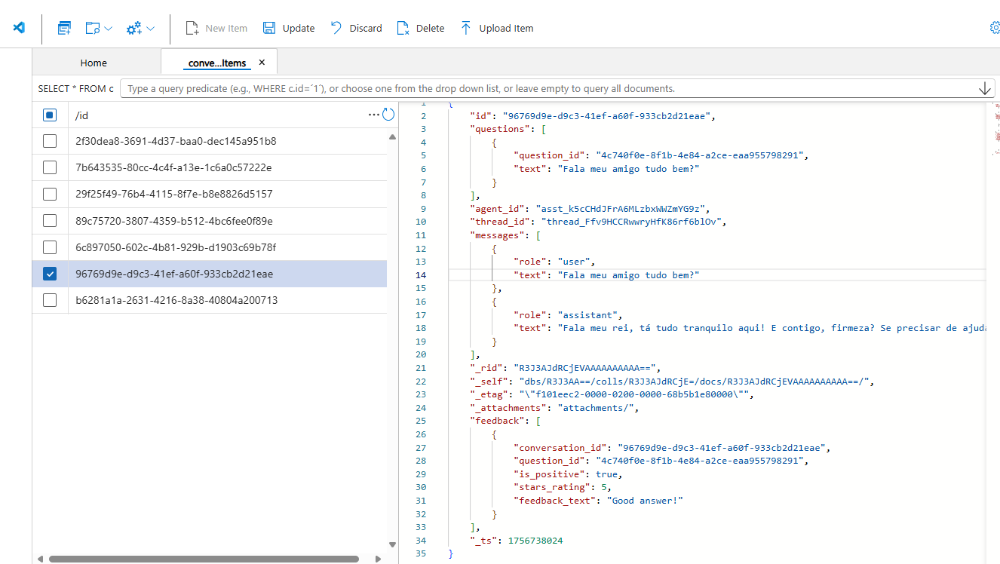
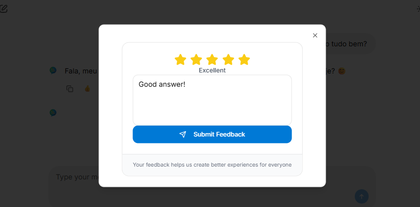
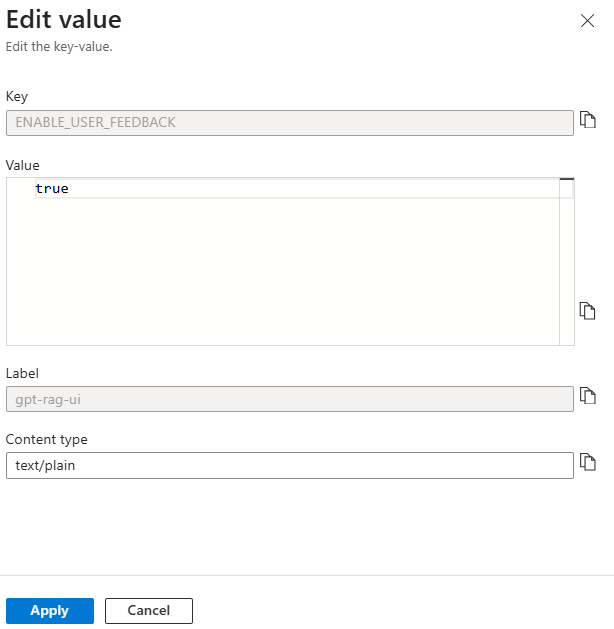
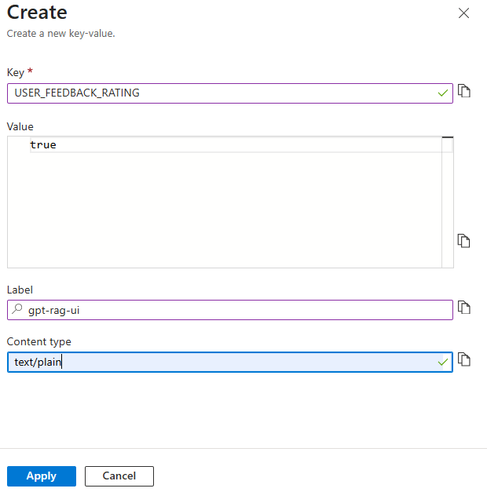

# User Feedback Configuration

GPT-RAG includes a **User Feedback Loop** feature that lets users evaluate
assistant responses through the UI. In the currently released classic
Container Apps topology and the explicit classic fallback, feedback is
processed by the orchestrator and stored in **Cosmos DB**. The
[upcoming hosted-default topology](deploy.md#chat-runtime-modes-upcoming-hosted-default-release)
is hosted/no-panel and does not include this feedback path. Its implementation
is merged but remains unreleased pending component and AI Landing Zone tags,
final umbrella pins, integrated validation, and a new GPT-RAG release. Keep
`DEPLOY_ADMINISTRATIVE_PANEL=false`; hosted feedback and panel workflows are
deferred to
[issue #611](https://github.com/Azure/GPT-RAG/issues/611).

 *User feedback stored in Cosmos DB*

By default, **basic feedback** (thumbs up/down) is enabled, while **detailed ratings** (star rating and comments) are disabled. Administrators control these options through **Azure App Configuration**.

## Feedback Types

When enabled, users can provide **star ratings** and text comments for richer feedback that captures both satisfaction and reasoning.

 *User providing rating and comment feedback*

## Configuration Settings

The behavior of the feedback loop is controlled by key-values in **Azure App Configuration**:

* **ENABLE\_USER\_FEEDBACK** → Default: `true`
  Controls whether the feedback feature is available at all.

 *Key to enable or disable user feedback globally*

* **USER\_FEEDBACK\_RATING** → Default: `false`
  Controls whether users can provide detailed feedback with ratings and comments.

 *Key to enable or disable detailed rating feedback*

## Default Values

* `ENABLE_USER_FEEDBACK = true`
* `USER_FEEDBACK_RATING = false`

This means feedback is collected by default, but **star ratings and comments** must be explicitly enabled by setting `USER_FEEDBACK_RATING` to `true`.
