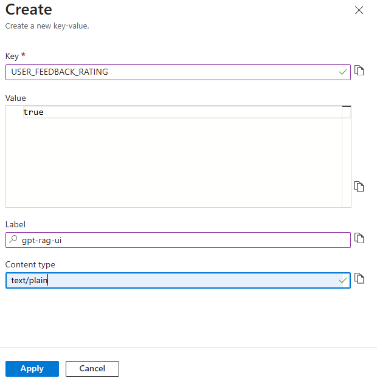

# User Feedback Configuration

GPT-RAG includes a **User Feedback Loop** feature that lets users evaluate assistant responses through the UI. Feedback is sent to the backend, processed by the orchestrator, and stored in **Cosmos DB** for analysis and continuous improvement.

 *User feedback stored in Cosmos DB*

By default, **basic feedback** (thumbs up/down) is enabled, while **detailed ratings** (star rating and comments) are disabled. Administrators control these options through **Azure App Configuration**.

## Feedback Types

When enabled, users can provide **star ratings** and text comments for richer feedback that captures both satisfaction and reasoning.

 *User providing rating and comment feedback*

## Configuration Settings

The behavior of the feedback loop is controlled by key-values in **Azure App Configuration**:

* **ENABLE\_USER\_FEEDBACK** → Default: `true`
  Controls whether the feedback feature is available at all.

 *Key to enable or disable user feedback globally*

* **USER\_FEEDBACK\_RATING** → Default: `false`
  Controls whether users can provide detailed feedback with ratings and comments.

 *Key to enable or disable detailed rating feedback*

## Default Values

* `ENABLE_USER_FEEDBACK = true`
* `USER_FEEDBACK_RATING = false`

This means feedback is collected by default, but **star ratings and comments** must be explicitly enabled by setting `USER_FEEDBACK_RATING` to `true`.
