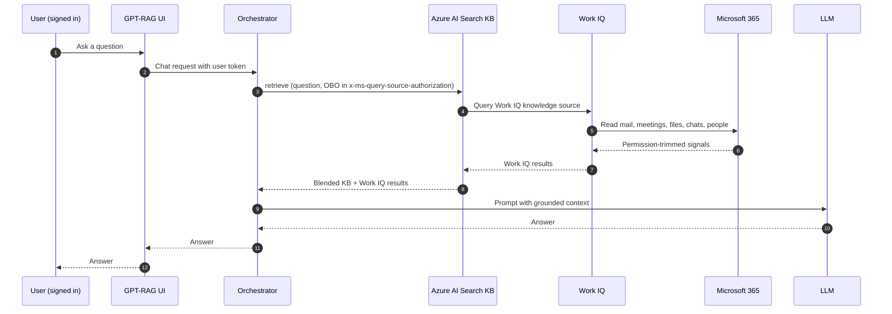

# Enabling Work IQ grounding

!!! warning "Public preview, gated access, no SLA"
    Work IQ is in gated public preview. Access must be requested and approved by
    Microsoft. There is no SLA, and behavior, quotas, and configuration may
    change without notice. Do not depend on Work IQ for production workloads
    until it is generally available.

Work IQ is an opt-in grounding source that lets the GPT-RAG orchestrator
augment answers with signals from the signed-in user's Microsoft 365 world:
mail, meetings, files, chats, and people. Work IQ is a Microsoft-managed
service that returns permission-trimmed results based on the calling user's
own M365 permissions. It runs alongside the existing knowledge base retrieval;
it does not replace it.

This page covers Work IQ only. Fabric IQ, another Foundry IQ grounding source,
will be documented separately.

## When to use Work IQ

Use Work IQ when:

- Users sign in to the GPT-RAG UI (or another authenticated client), so the
  orchestrator can obtain a delegated (OBO) token for the user.
- Answers benefit from personal or team context that lives in M365, such as
  recent emails, meetings, shared files, or chats.
- All target users have an active Microsoft 365 Copilot license.

Do not use Work IQ when:

- The deployment allows anonymous chat. Work IQ requires a signed-in user and
  cannot fall back to managed identity or app-only auth.
- The users do not have M365 Copilot licenses.
- Your compliance posture does not allow Microsoft-managed retrieval across
  Azure region boundaries. See the compliance note below.

## Prerequisites

Work through these in order. The first four are hard blockers.

1. Request access to the Work IQ gated preview from Microsoft and wait for
   approval.
2. Enable the subscription feature flag `EnableFoundryIQWithWorkIQ` on the
   Azure subscription that hosts the Foundry resource.
3. Submit Microsoft-approved admin consent for the Work IQ service principal
   in your tenant. The service principal `appId` is
   `fdcc1f02-fc51-4226-8753-f668596af7f7`. Use the Microsoft-provided consent
   form: <https://aka.ms/foundry-iq-work-iq-admin-consent-form>. Tenant admin
   consent is required, and it is a one-time step per tenant.
4. Assign a Microsoft 365 Copilot license to every user who should be able to
   ground answers on Work IQ. Users without a Copilot license get empty Work
   IQ results.
5. Make sure the Foundry resource and the target M365 tenant are in the same
   Entra tenant. Cross-tenant Work IQ is not supported.

## Configuration

All Work IQ settings live in Azure App Configuration on the GPT-RAG
deployment, under the `gpt-rag` label (or as container environment variables
when the deployment uses the `containerEnv` runtime mode).

| Setting | Default | Purpose |
| --- | --- | --- |
| `WORK_IQ_ENABLED` | `false` | Set to `true` to turn Work IQ on. |
| `WORK_IQ_KNOWLEDGE_SOURCE_NAME` | Not set | Name of the Work IQ knowledge source registered on the Foundry IQ knowledge base. Set this to the name your operator picked during onboarding. |
| `FOUNDRY_IQ_MAX_RUNTIME_SECONDS` | `120` | Total per-request retrieval budget for Foundry IQ, including Work IQ. Work IQ calls can take 40 to 60 seconds. Raise this only if Work IQ is timing out. |

Notes:

- Sign-in is required. The orchestrator only calls Work IQ when it has a
  delegated user token to forward. Anonymous chat requests skip Work IQ, even
  when `WORK_IQ_ENABLED=true`.
- Work IQ is additive. Your existing knowledge base retrieval (default Blob
  path or custom ingestion path) continues to run and is blended into the
  final answer.
- Enabling Work IQ does not remove the M365 Copilot license requirement for
  the end user. A missing license is a per-user failure, not a deployment
  failure.

## How Work IQ works

At runtime, the GPT-RAG orchestrator:

1. Verifies the incoming request has a signed-in user and obtains a delegated
   token for the user (on-behalf-of, OBO).
2. Calls the Foundry IQ knowledge base retrieve API with two grounding
   sources: the existing knowledge source (documents), and the Work IQ
   knowledge source.
3. Forwards the user's OBO token in the
   `x-ms-query-source-authorization` header so Work IQ can evaluate the
   user's permissions in M365.
4. Receives permission-trimmed results from Work IQ, blends them with the
   knowledge base results, and hands the merged context to the model.

## Compliance boundary caveat

Work IQ is a Microsoft-managed service. Requests and responses may cross
Azure region boundaries and are not confined to the region your Foundry
resource is deployed in. Before turning Work IQ on for regulated workloads,
review your compliance posture (data residency, sovereign cloud, and
data-sharing policies) and confirm that Microsoft-managed retrieval across
regions is acceptable.

## Troubleshooting

| Symptom | Likely cause | What to do |
| --- | --- | --- |
| 403 responses from Work IQ, or all Work IQ results empty across every user. | The `EnableFoundryIQWithWorkIQ` feature flag is missing, or admin consent for `appId fdcc1f02-fc51-4226-8753-f668596af7f7` has not been granted in your tenant. | Confirm the subscription feature flag is enabled and that a tenant admin has submitted the consent form. |
| Requests hit `FOUNDRY_IQ_MAX_RUNTIME_SECONDS` and time out. | Work IQ can take 40 to 60 seconds. The default 120 second budget is tight when the knowledge base is also slow. | Raise `FOUNDRY_IQ_MAX_RUNTIME_SECONDS` and re-test. Do not raise it beyond what your client and gateway timeouts allow. |
| Work IQ works for some users but returns empty results for one user. | That user is not signed in, or the user does not have an M365 Copilot license. | Confirm the user is signed in end to end (UI, orchestrator) and that the tenant has assigned an M365 Copilot license to the user. |
| Orchestrator logs show errors similar to "app-only not supported" or "delegated token required" for Work IQ. | The request reached Work IQ without an OBO token. Managed identity fallback does not apply to Work IQ. | Make sure the caller is a signed-in user, and that the UI and orchestrator are configured to forward the delegated token. See the Auth and Doc Security how-to. |

If Work IQ is unhealthy but you must keep serving traffic, set
`WORK_IQ_ENABLED=false` in App Configuration. The orchestrator will continue
to answer using the existing knowledge base only.

## Related reading

- Retrieval backend selection: how the default Blob path and custom ingestion
  path work, and how OBO is used for native ingested permissions.
- Auth and Doc Security: how the orchestrator obtains and forwards the
  user's delegated token.
