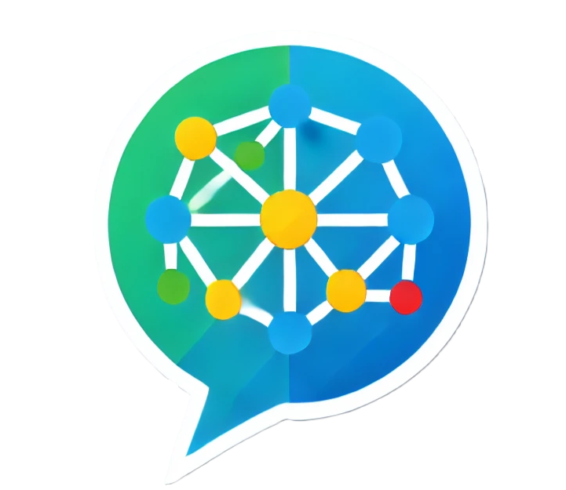
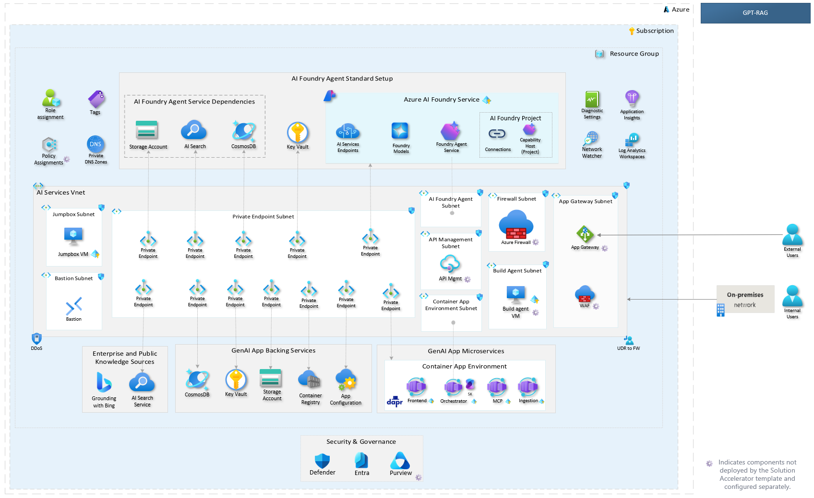

# GPT-RAG Solution Accelerator 

GPT-RAG is an enterprise-grade accelerator for building robust Retrieval-Augmented Generation (RAG) solutions on Azure. It provides a modular and secure foundation that integrates Azure OpenAI, AI Search, AI Foundry, and modern orchestration patterns to power intelligent assistants and data-driven applications across the enterprise.

Designed with Zero-Trust security and Infrastructure as Code (IaC) principles from the ground up, GPT-RAG accelerates production deployments while ensuring consistency, governance, and operational excellence. It supports text, image, and voice scenarios, enabling organizations to rapidly create rich multimodal experiences.

[Latest Stable Release {{ latest_release("azure/gpt-rag") }} :material-tag:](https://github.com/azure/gpt-rag/releases/latest){ .md-button--pill }

*Zero-Trust Architecture*

## Core Services

| Services                                                          | Description                                                                             |
| ----------------------------------------------------------------- | --------------------------------------------------------------------------------------- |
| **[Orchestrator](https://github.com/Azure/gpt-rag-orchestrator)** | Manages multi-agent workflows and retrieves context using Semantic Kernel and Azure AI. |
| **[Web UI](https://github.com/Azure/gpt-rag-ui)**                 | User interface for chat interactions, supports streaming and custom themes.             |
| **[Data Ingestion](https://github.com/Azure/gpt-rag-ingestion)**  | Extracts, chunks, and indexes enterprise data for optimized retrieval.                  |
| **[MCP Server](https://github.com/Azure/gpt-rag-mcp)**            | Implements the Model Context Protocol for tool hosting and business logic integration.  |

## Contributing

We welcome contributions from the community! Check our [Contribution Guidelines](contributing.md) for CLA, code of conduct, and PR guidelines.