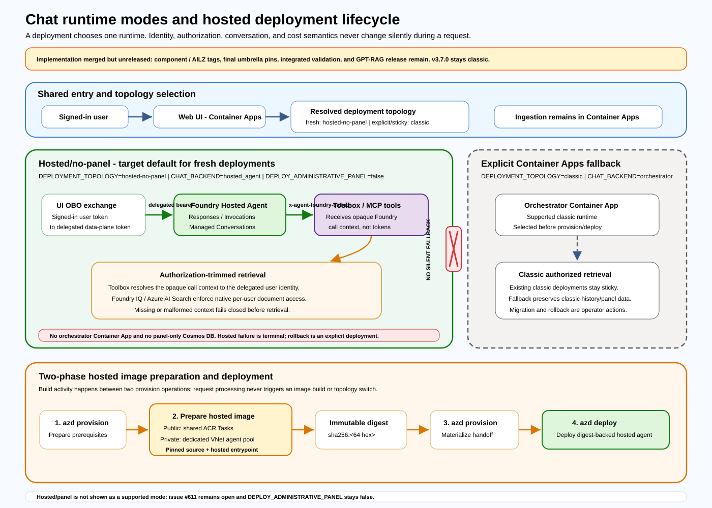
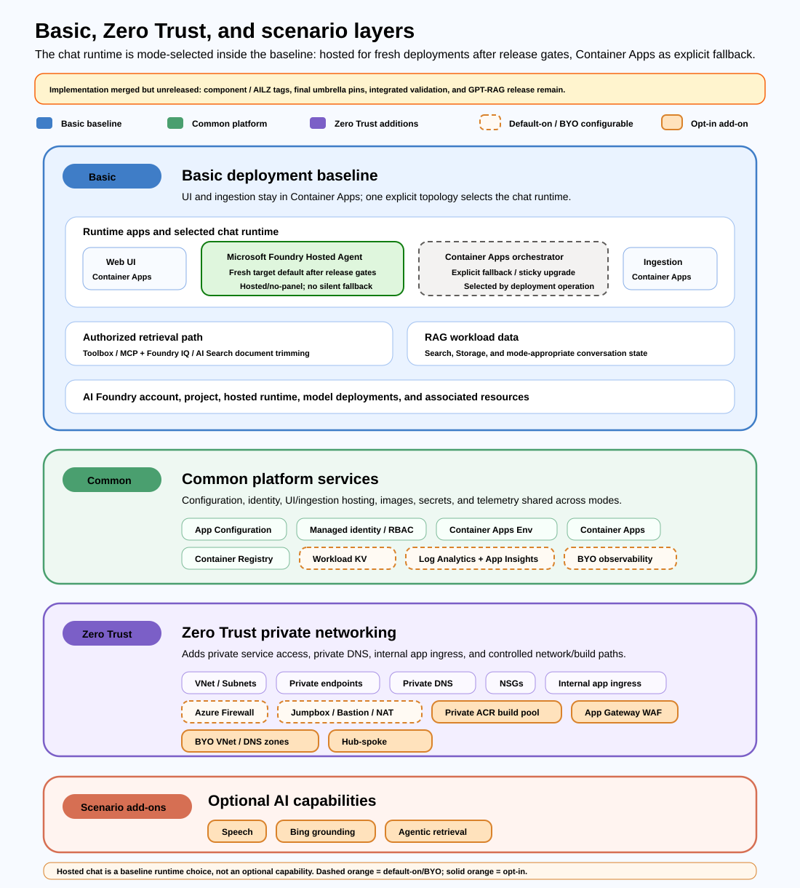
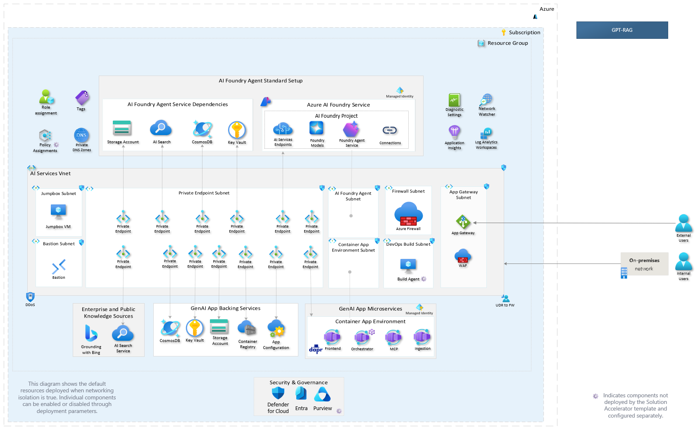

# GPT-RAG Solution Accelerator 

GPT-RAG is an enterprise-grade accelerator for building conversational AI assistants on Azure, powered by intelligent agents that understand questions, find the right information, and deliver clear, accurate answers using trusted enterprise data.

Designed with Zero-Trust security and Infrastructure as Code (IaC) principles from the ground up, GPT-RAG accelerates production deployments while ensuring consistency, governance, and operational excellence. It supports text, image, and voice scenarios, enabling organizations to rapidly create rich multimodal experiences.

[Latest Stable Release {{ latest_release("azure/gpt-rag") }} :material-tag:](https://github.com/azure/gpt-rag/releases/latest){ .md-button--pill }

[Pre-release {{ rc_tag }} :material-tag: ]({{ latest_release_candidate_url("azure/gpt-rag") }}){ data-md-color-accent="orange" .md-button--pill .md-button--pill--rc }


## Architecture at a glance

GPT-RAG can start as a Basic deployment and expand into Zero Trust, public
ingress, existing-platform integration, or optional AI capabilities. The
approved target makes Microsoft Foundry hosted/no-panel the fresh-deployment
chat runtime and retains the Container Apps orchestrator as an explicit
fallback. See the [Architecture](architecture.md) page for the mode contract
and required-vs-configurable deployment table.

!!! warning "Hosted-default release dependency"
    The diagram below is the approved target, not shipped behavior. The
    platform implementation merged in
    [Azure/GPT-RAG PR #617](https://github.com/Azure/GPT-RAG/pull/617), and the
    UI and AI Landing Zone release PRs merged, but their planned tags and
    GitHub Releases are not published. Final umbrella pins, integrated
    validation, and a new GPT-RAG release remain. Current published GPT-RAG
    `v3.7.0` stays classic.

*Full Zero Trust reference architecture. This is the complete network-isolated
view, not the minimum Basic deployment. The focused SVG above is the source of
truth for the pending hosted-default runtime update.*

## Governance

Before connecting enterprise data or relying on telemetry as evidence, review
[Governance and responsible operation](governance_overview.md). It explains
intended use, limitations, data and telemetry responsibilities, retention,
access, and the exact audit trail contract available since
[GPT-RAG v3.7.0](https://github.com/Azure/GPT-RAG/releases/tag/v3.7.0),
disabled by default.

## Runtime Services

| Services                                                          | Description                                                                             |
| ----------------------------------------------------------------- | --------------------------------------------------------------------------------------- |
| **[Orchestrator](https://github.com/Azure/gpt-rag-orchestrator)** | Manages agentic workflows with Microsoft Agent Framework, Azure AI, and strategy-specific integrations. |
| **[Web UI](https://github.com/Azure/gpt-rag-ui)**                 | User interface for chat interactions, supports streaming and custom themes.             |
| **[Data Ingestion](https://github.com/Azure/gpt-rag-ingestion)**  | Extracts, chunks, and indexes enterprise data for optimized retrieval.                  |
| **[MCP Server](https://github.com/Azure/gpt-rag-mcp)**            | Optional Model Context Protocol service for tool hosting and business logic integration. |

## Contributing

We welcome contributions from the community! Check our **[Contribution Guidelines](contributing.md)** for CLA, code of conduct, and PR guidelines.