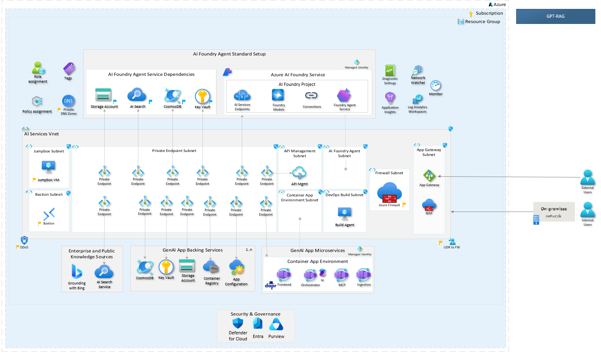

# GPT-RAG Solution Accelerator

## Overview

GPT-RAG is a powerful, enterprise-ready accelerator that transforms how organizations build Retrieval-Augmented Generation (RAG) solutions on Azure. By leveraging Azure OpenAI, AI Search, and AI Foundry, it delivers a secure, modular foundation for creating intelligent conversational assistants and data-driven applications. [View the source code on GitHub](https://github.com/Azure/gpt-rag).

Built from the ground up with Zero-Trust security principles and Infrastructure as Code (IaC), GPT-RAG accelerates your journey to production-ready AI solutions. Whether you're working with text, images, or voice, this comprehensive platform combines enterprise-grade security, intelligent orchestration, and multimodal capabilities to deliver exceptional user experiences faster than ever.

## Core Services

| Services                                                          | Description                                                                             |
| ----------------------------------------------------------------- | --------------------------------------------------------------------------------------- |
| **[Orchestrator](https://github.com/Azure/gpt-rag-orchestrator)** | Manages multi-agent workflows and retrieves context using Semantic Kernel and Azure AI. |
| **[Web UI](https://github.com/Azure/gpt-rag-ui)**                 | User interface for chat interactions, supports streaming and custom themes.             |
| **[Data Ingestion](https://github.com/Azure/gpt-rag-ingestion)**  | Extracts, chunks, and indexes enterprise data for optimized retrieval.                  |
| **[MCP Server](https://github.com/Azure/gpt-rag-mcp)**            | Implements the Model Context Protocol for tool hosting and business logic integration.  |

## Contributing

We welcome contributions from the community! Check our [Contribution Guidelines](contributing.md) for CLA, code of conduct, and PR guidelines.