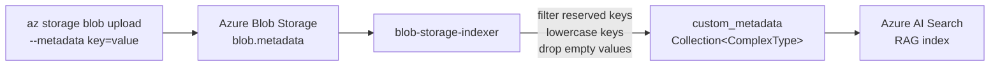

# Blob Data Source

The **Blob Data Source** ingests documents from the **`documents` container** in your Azure Storage Account into Azure AI Search and keeps the index synchronized when files are updated or removed. It is designed for production-scale document processing with incremental updates, smart freshness detection, and automated cleanup.

## How it Works

The Blob Data Source operates through **two independent jobs** that can be scheduled separately for optimal resource usage and data freshness.

**Indexing job** (`blob-storage-indexer`) scans the configured blob container (optionally filtered by `BLOB_PREFIX`) and processes documents into searchable chunks. It uses **smart freshness detection** by comparing each blob's `last_modified` timestamp with the indexed version, skipping unchanged files to save processing time and costs. For each new or modified file, the indexer downloads the blob, chunks it using Azure Document Intelligence, deletes any existing chunks for that file (by `parent_id`), and uploads new chunks with stable, search-safe IDs. Each chunk document sets `source = "blob"` to enable cleanup operations, and when available in blob metadata, includes `metadata_security_id` for security trimming scenarios.

**Purging job** (`blob-storage-purger`) maintains index hygiene by removing orphaned documents. It compares parent documents in blob storage with parent documents in the AI Search index (where `source == "blob"`), identifies chunks belonging to files that no longer exist in storage, and deletes them in batches. The job waits briefly after deletion to ensure accurate document counts, as Azure AI Search uses eventual consistency for index statistics.

**Files are processed in parallel** using a configurable semaphore (`INDEXER_MAX_CONCURRENCY`, default: 4) to balance throughput with service limits. Each file goes through download → security metadata extraction → document chunking → chunk conversion → batch upload. Batch uploads use `INDEXER_BATCH_SIZE` (default: 500) to optimize AI Search API calls while staying within request size limits.

**Supported formats** include PDF, Word (.docx), PowerPoint (.pptx), Excel (.xlsx), text (.txt, .md), images (.jpg, .png, .bmp, .tiff), and HTML. OCR extraction is performed automatically for PDFs and images using Azure Document Intelligence.

## Ingestion Flow

**Indexing Job**

<div class="no-wrap">
```
┌────────────────────────────────────────────────────────────────────────────────┐
│                      BLOB STORAGE INGESTION FLOW                               │
│                                                                                │
│  ┌────────────────────┐           ┌─────────────────────────────────────────┐  │
│  │  Azure Blob        │           │      Index State Cache                  │  │
│  │  Storage           │           │  • Load existing timestamps             │  │
│  │  • Source Container│◄──────────│  • Build parent_id → lastModified map   │  │
│  │  • Blob Metadata   │           │  • Detect already-indexed docs          │  │
│  │  • Security IDs    │           │    (incremental updates)                │  │
│  └─────────┬──────────┘           └─────────────────────────────────────────┘  │
│            │                                                                   │
│            │ List Blobs + Filter by Prefix                                     │
│            v                                                                   │
│  ┌─────────────────────────────────────────────────────────────────────────┐   │
│  │                      Freshness Check                                    │   │
│  │                                                                         │   │
│  │  For each blob:                                                         │   │
│  │    • Compare blob.last_modified vs indexed timestamp                    │   │
│  │    • Skip if blob.last_modified ≤ indexed timestamp                     │   │
│  │    • Queue for processing if blob is newer or not indexed               │   │
│  └───────────────────────────────┬─────────────────────────────────────────┘   │
│                                  │                                             │
└──────────────────────────────────┼─────────────────────────────────────────────┘
                                   │
                                   v
┌────────────────────────────────────────────────────────────────────────────────┐
│                          PROCESSING PIPELINE                                   │
│                                                                                │
│  ┌──────────────────────────────────────────────────────────────────────────┐  │
│  │                    blob_storage_indexer.py                               │  │
│  │                                                                          │  │
│  │  ┌──────────────┐  ┌──────────────┐  ┌──────────────┐  ┌──────────────┐  │  │
│  │  │  Download    │  │  Security    │  │  Document    │  │  Chunk       │  │  │
│  │  │  Blob        │─>│  Metadata    │─>│  Chunker     │─>│  Conversion  │  │  │
│  │  │  (Binary)    │  │  Extraction  │  │  (PDF/Docs)  │  │  to Search   │  │  │
│  │  └──────────────┘  └──────────────┘  └──────────────┘  └──────┬───────┘  │  │
│  │                                                               │          │  │
│  │  ┌──────────────┐  ┌──────────────┐                           │          │  │
│  │  │  Index       │  │  Delete Old  │◄──────────────────────────┘          │  │
│  │  │  Batch       │◄─│  Parent Docs │  (Remove existing chunks)            │  │
│  │  │  Upload      │  │  by parent_id│                                      │  │
│  │  └──────────────┘  └──────────────┘                                      │  │
│  │                                                                          │  │
│  └──────────────────────────────────────────────────────────────────────────┘  │
│                                                                                │
│  • Parallel Processing: Configurable semaphore (INDEXER_MAX_CONCURRENCY)       │
│  • Batch Size: 500 docs per AI Search batch (INDEXER_BATCH_SIZE)               │
│  • Error Handling: Per-blob try/catch with individual file logs                │
│                                                                                │
└────────────────────────────────────────────────────────────────────────────────┘
                                   │
                                   v
┌────────────────────────────────────────────────────────────────────────────────┐
│                            OUTPUT & STORAGE                                    │
│                                                                                │
│  ┌──────────────────────┐  ┌──────────────────────┐  ┌──────────────────────┐  │
│  │  Azure AI Search     │  │  Azure Blob Storage  │  │    Telemetry         │  │
│  │  • Indexed Chunks    │  │  • Run Summaries     │  │  • App Insights      │  │
│  │  • Vector Embeddings │  │  • Per-File Logs     │  │  • Structured Logs   │  │
│  │  • Security IDs      │  │  • Processing State  │  │  • Performance       │  │
│  │  • Metadata          │  │  (jobs container)    │  │  • Error Tracking    │  │
│  │  source=blob         │  │                      │  │                      │  │
│  └──────────────────────┘  └──────────────────────┘  └──────────────────────┘  │
│                                                                                │
└────────────────────────────────────────────────────────────────────────────────┘
```
</div>

## Scheduling

Jobs are enabled through CRON expressions:

* `CRON_RUN_BLOB_INDEX`: runs the indexing job
* `CRON_RUN_BLOB_PURGE`: runs the purge job
* Leave unset to disable

The scheduler uses `SCHEDULER_TIMEZONE` (IANA format, e.g., `Europe/Berlin`), falling back to the host machine’s timezone if not specified.
On startup, if a CRON is configured, the corresponding job is scheduled and also triggered once immediately.

**Examples:**

* `0 * * * *` → hourly
* `*/15 * * * *` → every 15 minutes
* `0 0 * * *` → daily at midnight

## Settings

* `STORAGE_ACCOUNT_NAME` and `DOCUMENTS_STORAGE_CONTAINER`: source location
* `SEARCH_SERVICE_QUERY_ENDPOINT` and `SEARCH_RAG_INDEX_NAME`: target index
* `BLOB_PREFIX` *(optional)*: restricts the scan scope
* `JOBS_LOG_CONTAINER` *(default: jobs)*: container for logs
* `INDEXER_MAX_CONCURRENCY`: concurrency, defaults: `4`.
* `INDEXER_BATCH_SIZE`: batch size, defaults: `500`

>   
> `INDEXER_MAX_CONCURRENCY` controls how many files are processed in parallel (download → chunk → upload). `INDEXER_BATCH_SIZE` controls how many chunk documents are sent in each upload call to Azure AI Search. Increase these to raise throughput, but watch for throttling (HTTP 429), timeouts, and memory usage; lower them if you see retries or instability. The default batch size (500) follows common guidance to keep batches reasonable (typically ≤ 1000).

## Custom blob metadata

Any custom metadata you set on a blob is automatically captured during ingestion and indexed in Azure AI Search as key/value pairs in the `custom_metadata` field. This lets you tag documents with arbitrary attributes (department, owner, project, classification, etc.) and then filter or facet on them at query time, without changing the document content and without any configuration.

This behavior is always on. There is no setting to enable or disable it.

### Index field

Every chunk in the RAG index carries a `custom_metadata` collection of `{key, value}` pairs:

```json
{
  "name": "custom_metadata",
  "type": "Collection(Edm.ComplexType)",
  "fields": [
    { "name": "key",   "type": "Edm.String", "searchable": false, "retrievable": true, "filterable": true, "facetable": true },
    { "name": "value", "type": "Edm.String", "searchable": true,  "retrievable": true, "filterable": true, "facetable": true }
  ]
}
```

`key` is filterable and facetable so you can use it for exact matches and tag discovery. `value` is also searchable, so full-text search over tag values is available when needed.

### Flow



### Tagging a blob

Set metadata at upload time, or update it on an existing blob:

```bash
az storage blob upload \
  --container-name documents \
  --file report.pdf \
  --metadata department=finance owner=alice project=q4-review \
  --auth-mode login

az storage blob metadata update \
  --container-name documents \
  --name report.pdf \
  --metadata department=finance owner=alice \
  --auth-mode login
```

The next time the indexer processes the blob (because the blob is new or its `last_modified` changed), each pair becomes one entry in `custom_metadata` on every chunk produced for the file.

### Filtering search results by tag

Use the OData `$filter` syntax for complex collections:

```text
$filter=custom_metadata/any(m: m/key eq 'department' and m/value eq 'finance')
```

Combine multiple tags with `and`:

```text
$filter=custom_metadata/any(m: m/key eq 'department' and m/value eq 'finance')
    and custom_metadata/any(m: m/key eq 'owner' and m/value eq 'alice')
```

### Discovering which tags exist

Use a facet over `custom_metadata/key` to list all tag names currently in the corpus, with counts:

```text
facet=custom_metadata/key,count:50
```

You can also facet on `custom_metadata/value` to discover the distinct values used for a specific tag.

### Rules and limits

- **Reserved keys are filtered out.** Keys reserved for document-level security are written to their own typed fields and never appear in `custom_metadata`: `metadata_security_user_ids`, `metadata_security_group_ids`, `metadata_security_id`, `metadata_security_rbac_scope`.
- **Keys are lowercase.** Azure Blob Storage stores metadata names case-insensitively, so keys land in the index in lowercase. Query filters and facets must use the lowercase form.
- **Empty values are dropped.** Keys with `None` or empty string values are not indexed.
- **Blob metadata size limit.** Azure Blob Storage caps total metadata at 8 KB per blob (names plus values combined). Plan tag sets within that budget.
- **Tag values are strings.** Numbers, dates, and booleans are stored as strings. Cast them in your query layer if you need typed comparisons.

### Operating an existing deployment

Documents that were indexed before this change return `custom_metadata: []` until they are reingested. To roll the change out on an existing environment:

1. **Reapply the index schema.** Adding `custom_metadata` is an additive operation on Azure AI Search, so existing documents and other fields are preserved.
2. **Reingest the blobs that should expose tags.** The simplest way is to update each blob's metadata (which bumps `last_modified` and makes the indexer pick it up on the next run), or to clear the relevant entries from the index state so the freshness check reprocesses them.

New deployments require no extra step. The field is part of the index schema and every newly indexed blob is tagged automatically.

## Logs

Both jobs write logs to the configured jobs container. Logs are grouped by job type:

* **Indexer (`blob-storage-indexer`)**
    * Per-file logs and per-run summaries under `files/` and `runs/`
    * Summaries include: `sourceFiles`, `candidates`, `success/failed`, `totalChunksUploaded`

* **Purger (`blob-storage-purger`)**
    * Per-run summaries under `runs/`
    * Summaries include: `blobDocumentsCount`, `indexParentsCountBefore/After`, `indexChunkDocumentsBefore`, `indexParentsPurged`, `indexChunkDocumentsDeleted`

## Observability

The blob storage indexer emits structured Application Insights events (`RUN-*`, `ITEM-*`) with JSON payloads embedded in the `message` field.

**Latest Job Runs**

View recent indexing jobs with key metrics:

```kql
let Logs = union isfuzzy=true traces, AppTraces;
Logs
| where message contains "RUN-COMPLETE" and message contains "blob-storage-indexer"
| extend payload = parse_json(extract('\\{.*', 0, message))
| where tostring(payload.event) == "RUN-COMPLETE"
| project timestamp,
          runId = tostring(payload.runId),
          status = tostring(payload.status),
          sourceFiles = toint(payload.sourceFiles),
          itemsDiscovered = toint(payload.itemsDiscovered),
          indexedItems = toint(payload.indexedItems),
          skippedNoChange = toint(payload.skippedNoChange),
          failed = toint(payload.failed),
          totalChunksUploaded = toint(payload.totalChunksUploaded),
          durationSeconds = todouble(payload.durationSeconds)
| order by timestamp desc
```

**Purge Summary Stats**

Inspect the most recent purge runs and their cleanup metrics:

```kql
let Logs = union isfuzzy=true traces, AppTraces;
Logs
| where message contains "blob-storage-purger"
    and message contains "Summary:"
| extend payload = parse_json(extract('\\{.*', 0, message))
| extend runStartedAt  = todatetime(payload.runStartedAt),
                 runFinishedAt = todatetime(payload.runFinishedAt)
| project
        timestamp,
        runStartedAt,
        runFinishedAt,
        durationSeconds           = datetime_diff("second", runFinishedAt, runStartedAt),
        blobDocumentsCount        = toint(payload.blobDocumentsCount),
        indexParentsCountBefore   = toint(payload.indexParentsCountBefore),
        indexChunkDocumentsBefore = toint(payload.indexChunkDocumentsBefore),
        indexParentsPurged        = toint(payload.indexParentsPurged),
        indexChunkDocumentsDeleted= toint(payload.indexChunkDocumentsDeleted),
        indexParentsCountAfter    = toint(payload.indexParentsCountAfter)
| order by timestamp desc
```

**Items in Specific Indexer Run**

List all files processed during a particular run:

```kql
let TargetRunId = '20251121T231125Z';
let Logs = union isfuzzy=true traces, AppTraces;
Logs
| where message contains "ITEM-COMPLETE" and message contains "blob-storage-indexer"
| extend payload = parse_json(extract('\\{.*', 0, message))
| where tostring(payload.event) == "ITEM-COMPLETE" and tostring(payload.runId) == TargetRunId
| project timestamp,
          blobName = tostring(payload.blobName),
          parentId = tostring(payload.parentId),
          status = tostring(payload.status),
          totalChunks = toint(payload.totalChunks),
          contentType = tostring(payload.contentType),
          fileUrl = tostring(payload.fileUrl)
| order by timestamp desc
```

**File Indexing History**

Track processing history for a specific file:

```kql
let TargetParent = '/documents/employee_handbook.pdf';
let Logs = union isfuzzy=true traces, AppTraces;
Logs
| where message contains "ITEM-COMPLETE" and message contains "blob-storage-indexer"
| extend payload = parse_json(extract('\\{.*', 0, message))
| where tostring(payload.event) == "ITEM-COMPLETE" and tostring(payload.parentId) == TargetParent
| project timestamp,
          runId = tostring(payload.runId),
          blobName = tostring(payload.blobName),
          status = tostring(payload.status),
          totalChunks = toint(payload.totalChunks),
          contentType = tostring(payload.contentType),
          fileUrl = tostring(payload.fileUrl)
| order by timestamp desc
```

**Recent Indexer Errors**

View recent warnings and errors:

```kql
let Logs = union isfuzzy=true traces, AppTraces;
Logs
| where severityLevel >= 3 and message contains "blob-storage-indexer"
| extend payload = parse_json(extract('\\{.*', 0, message))
| project timestamp,
          severityLevel,
          event = tostring(payload.event),
          runId = tostring(payload.runId),
          blobName = tostring(payload.blobName),
          parentId = tostring(payload.parentId),
          error = tostring(payload.error),
          message
| order by timestamp desc
```