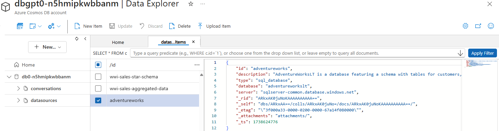

# NL2SQL / Fabric Metadata Data Source

The **NL2SQL ingestion process** loads structured metadata from **blob storage**—including tables, measures, and sample queries—into Azure AI Search. This metadata provides the orchestrator with the necessary context to generate accurate SQL and DAX queries.

Each JSON file defines the metadata for one entity (a table, measure, or query).

## How It Works

### Push-based Indexing

The service reads JSON files directly from blob storage, validates their schemas, and generates embeddings with the configured model. The metadata is then inserted or updated in Azure AI Search.

### Updates (Change Detection)

Updates follow an upsert approach: existing metadata is replaced, new metadata is added. Change detection uses blob metadata (`Last-Modified`, `ETag`), so only modified or missing entries are re-indexed, while unchanged ones are skipped.

### Purging

A purge job compares index entries with the JSON files in blob storage. Any entry without a matching file is removed, keeping the index consistent with the source.

## Metadata Structure

NL2SQL and Chat-with-Fabric rely on metadata to give the orchestrator structured information for optimized SQL and DAX queries. The metadata consists of three types:

* **Table metadata**: Descriptions of tables and columns
* **Query metadata**: Example SQL or DAX queries with natural-language intent
* **Measure metadata**: Definitions of Power BI semantic model measures

### Folder Structure

Store metadata JSON files in dedicated folders:

* `tables/` — Table metadata
* `measures/` — Measure metadata
* `queries/` — Query metadata

Suggested filenames:

* Table metadata: `dimension_city.json`
* Measure metadata: `total_revenue.json`
* Query metadata: `top_5_expensive_products.json`

### Metadata Types

#### Table Metadata

**Elements**

* `table`: table name
* `description`: purpose of the table
* `datasource`: datasource ID
* `columns`: list of columns

  * `name`
  * `description`
  * `type` (optional)
  * `examples` (optional)

**Example**

```json
{
  "table": "sales_order",
  "description": "Table containing sales order data.",
  "datasource": "wwi-sales-data",
  "columns": [
    { "name": "OrderID", "description": "Unique identifier for each sales order." },
    { "name": "OrderDate", "description": "Date when the sales order was placed." }
  ]
}
```

#### Query Metadata

**Elements**

* `datasource`: datasource ID
* `question`: natural-language question the query answers
* `query`: SQL or DAX text
* `reasoning` (optional)

**Example**

```json
{
  "datasource": "adventureworks",
  "question": "What are the top 5 most expensive products currently available for sale?",
  "query": "SELECT TOP 5 ProductID, Name, ListPrice FROM SalesLT.Product WHERE SellEndDate IS NULL ORDER BY ListPrice DESC",
  "reasoning": "Retrieves top 5 products by ListPrice that are currently for sale."
}
```

#### Measure Metadata

**Elements**

* `datasource`: datasource ID
* `name`: measure name
* `description`: what it calculates
* `type`: `external` or `local`
* `source_table` (local only)
* `data_type`, `source_model` (external only)

**Example**

```json
{
  "datasource": "Ecommerce",
  "name": "Total Revenue (%)",
  "description": "Calculates percentage of total revenue for the selected period.",
  "type": "external",
  "data_type": "CURRENCY",
  "source_model": "Executive Sales Dashboard"
}
```

> 
> More examples are available in the `samples/` folder.

## NL2SQL Data Sources

Supported datasource types:

- semantic_model — Runs DAX queries via Power BI REST API
- sql_endpoint — Connects via ODBC with a Service Principal
- sql_database — Connects via ODBC with Managed Identity

## Data Sources Configuration

Data sources contain connection information for the target systems.

Supported data source types include:

- Semantic Model: Executes DAX queries using the Power BI REST API.
- SQL Endpoint: Connects via ODBC using a Service Principal.
- SQL Database: Connects via ODBC using Managed Identity.

Data source configuration in GPT-RAG is managed through JSON documents stored in the datasources container of **Cosmos DB**.

  
<BR><i>Sample Datasource Configuration</i>

### Semantic Model Example
```json
{
  "id": "wwi-sales-aggregated-data",
  "description": "Aggregated sales data for insights such as sales by employee or city.",
  "type": "semantic_model",
  "organization": "myorg",
  "dataset": "your_dataset_or_semantic_model_name",
  "tenant_id": "your_sp_tenant_id",
  "client_id": "your_sp_client_id"
}
```

### SQL Endpoint Example
```json
{
  "id": "wwi-sales-star-schema",
  "description": "Star schema with sales data and dimension tables.",
  "type": "sql_endpoint",
  "organization": "myorg",
  "server": "your_sql_endpoint.fabric.microsoft.com",
  "database": "your_lakehouse_name",
  "tenant_id": "your_sp_tenant_id",
  "client_id": "your_sp_client_id"
}
```

### SQL Database Example
```json
{
  "id": "adventureworks",
  "description": "AdventureWorksLT database with customers, orders, and products.",
  "type": "sql_database",
  "database": "adventureworkslt",
  "server": "sqlservername.database.windows.net"
}
```

For data sources that require secrets—such as those accessed via a Service Principal or SQL Server using SQL authentication—passwords are stored in Azure Key Vault following the naming convention {datasource_id}-secret.

Example: If the datasource_id is wwi-sales-star-schema, the corresponding secret name in Key Vault should be wwi-sales-star-schema-secret.

  
<BR><i>Sample Datasource Secrets</i>

>   
> Example configuration files are available in the [sample folder](https://github.com/Azure/gpt-rag-ingestion/blob/main/samples/fabric/datasources.json).

## Settings

Add the following configuration values to **App Configuration Settings**, using either the `gpt-rag` or `gpt-rag-ingestion` labels:

* `STORAGE_ACCOUNT_NAME` — The storage account where metadata JSON files are located.
* `NL2SQL_STORAGE_CONTAINER` — The container holding metadata files (default: `nl2sql`).
* `JOBS_LOG_CONTAINER` — The container used for logs (default: `jobs`).
* `INDEXER_MAX_CONCURRENCY` — Maximum number of files processed concurrently (default: `4`).
* `SEARCH_QUERIES_INDEX_NAME` — Index name for query metadata.
* `SEARCH_TABLES_INDEX_NAME` — Index name for table metadata.
* `SEARCH_MEASURES_INDEX_NAME` — Index name for measure metadata.

> 
> If an index name is not provided, documents of that type will not be indexed, and a warning will be logged. The embedding model configuration is automatically taken from the GPT-RAG Microsoft Foundry settings defined during infrastructure deployment.

## Scheduling

Because ingestion is **push-based**, updates are triggered by a CRON schedule for periodic refreshes.

Add the following settings to **App Configuration Settings**, using either the `gpt-rag` or `gpt-rag-ingestion` labels:

* `CRON_RUN_NL2SQL_INDEX` — Runs the NL2SQL indexing job.
* `CRON_RUN_NL2SQL_PURGE` — Runs the NL2SQL purge job.

> 
> If you do not set a CRON expression for one of these values, that job will **not run automatically**. For example, if `CRON_RUN_NL2SQL_PURGE` is left empty or not defined, purge operations will never be scheduled.

### Examples of CRON expressions

* `0 * * * *` → Runs hourly.
* `*/15 * * * *` → Runs every 15 minutes.
* `0 0 * * *` → Runs daily at midnight.

### Timezone

The scheduler uses the `SCHEDULER_TIMEZONE` setting (IANA format, e.g., `Europe/Berlin`). If not specified, it defaults to the host machine’s timezone.

### Startup behavior

When the application starts, if a CRON expression is configured, the corresponding job is scheduled **and also triggered once immediately**.

## Logs

Logs are stored in `JOBS_LOG_CONTAINER`:

* **Runs** (`nl2sql-indexer/runs/`)

    * One summary JSON per run (`{runId}.json`)
    * Includes totals for query, table, and measure metadata

* **Files** (`nl2sql-indexer/files/`)

    * One JSON per file, named after the blob path (slashes replaced with dashes)
    * Includes blob metadata, embedding vector size, status, and errors (if any)

These logs show skipped files, re-indexed metadata, failures, and per-run statistics.