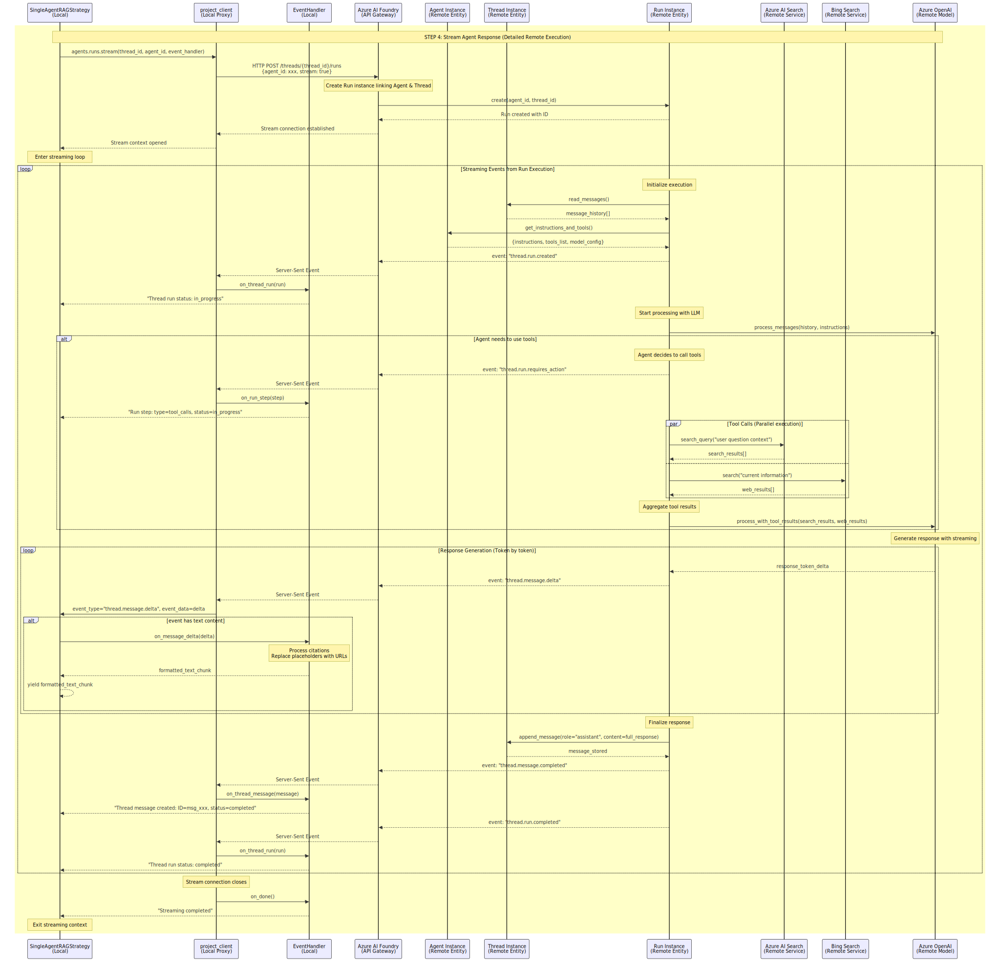

# Orchestrator: Start Your Code Reading with Visuals

*A picture is worth a thousand words.*  
Yet many engineers write another thousand words instead of drawing a single useful diagram.  
Let’s reverse this evolution — with visuals.

Starting with diagrams — with a bit of simplification and abstraction — can significantly accelerate the comprehension of complex codebases. This is especially true when the data flow spans multiple execution environments (local machine (or VM on cloud), remote AI Foundry, Azure cloud resources), where the initial orientation can otherwise be challenging.

---

### Why This Article Exists

When I started reading the code, I struggled:

- Where is the entry point?
- What calls what?
- What runs locally and what in the cloud?
- What is the big picture (helicopter view)?
- Which design patterns are applied?
- What is the role of the Orchestrator in the data flow?

If you have ever felt **dazed and confused by a codebase with many layers of abstraction**, this is for you.
If you prefer talking for hours about a diagram instead of drawing it, just leave.

### Target Audience
Folks with an *engineering mindset* who want to *understand before modifying.*

### Hardware Recommendation
Use a large monitor (32-inch or larger). Diagrams require space.

> Note: Each diagram is available in multiple formats (`.png`, `.jpg`, `.svg`).
> While SVG is technically the optimal and resolution-independent format,
> some operating systems and PDF export workflows do not reliably render SVG.
> To ensure accessibility and consistent viewing experience across different
> environments, alternative formats are provided.

---

## Start With the Glossary

The glossary is a shared language. Without clear and standardized terminology, people cannot meaningfully discuss ideas — they end up talking past each other. Shared terms are the foundation of shared understanding.

| Term | Definition |
|---|---|
| **Ask** | What the user says in natural language. It is the raw user message before any system processing. |
| **Query** | The Ask transformed into a form suitable for retrieval (for example, converted to an embedding vector). The embedding vector is used to retrieve grounding document chunks from a vector database. Note: The Query is not part of the Prompt. Note: In practice, Ask and Query are often used interchangeably. |
| **Prompt** | The final constructed input sent to the language model. It may include the user’s Ask, retrieved document chunks, dialogue history, and system instructions. |
| **Request** | The HTTPS API call sent to the model endpoint to generate a Response. |
| **Response** | The output returned by the model after processing a Request. |
| **Message** | A single user, assistant, or system message in a Conversation. It can be an Ask, a Response, or a system/instruction message that may be included when constructing a Prompt. |
| **Turn** | A pair of Ask + Response. |
| **Interaction** | Another word for Turn. One full cycle of Ask → Response. |
| **Conversation** | A sequence of Interactions over time (many Turns), with the history persisted and reused as context. |
| **Dialogue** | The communication pattern of exchanging messages. A Conversation is an instance of a Dialogue sustained over time. |
| **Thread** | A platform-specific (AI Foundry) object that persists the Conversation History, identified by a thread ID. |
---

## Conversation is a Sequence of Turns (Interactions)
Each user Ask and system Response adds one turn to the conversation.
```
Conversation
  ├── Turn #1
  │      Ask
  │      Response
  ├── Turn #2
  │      Ask
  │      Response
  └── ...
```

---

## Retrieving Grounding Chunks
Grounding Chunks are critical because they anchor the model’s answer in factual, domain-correct information instead of relying on the model’s general knowledge or guesswork.
Note: Retrieval is based solely on the Ask. No other parts of the Prompt are used. The only input used for retrieval is the Ask.
```
-----------------------------
Ask (user text)
   |
   | The Ask is converted into an embedding vector.
   |
   v
Query (the embedding vector used for retrieval)
   |
   | retrieval from a vector database
   |
   v
Grounding Chunks
-----------------------------
```

---

## Constructing and Processing the Prompt
The Prompt is fed into the LLM model, which in turn generates the Response.
```
-----------------------------
Prompt = System prompt
       + Conversation History
       + Ask
       + Grounding Chunks
       + Instructions
       + Formatting Rules
-----------------------------
   |
   | LLM takes Prompt
   |
   v
Response (LLM output)
   |
   | AI Foundry maintains Conversation History
   | inside Thread objects
   |
   v
Conversation grows by one Turn (Ask + Response)
```

---

## Example of a Real Prompt
Note: Grounding chunks are not part of the Conversation History. This can feel counter-intuitive, because they appear in the prompt alongside the user message, but they are inserted only at runtime to support retrieval. They are not stored or carried forward as part of the dialogue context (Conversation History).
```
-----------------------------------------------------------
SYSTEM:
You are a helpful customer support assistant.

CONVERSATION HISTORY:
"""
USER ASK: How do I know my account is active?
RESPONSE: You can sign in.
USER ASK: Do you notify me before expiration date?
RESPONSE: Yes, we will text you.
"""

USER ASK:
How do I renew my business account?

RETRIEVED CONTEXT:
Document: Renewal Policy Guide
To renew the business account, the user must log in, navigate to 'Billing', select 'Account Renewal', and submit updated documents.

INSTRUCTIONS:
Answer using the context above. If the answer is not in the context, say you don’t know.

FORMATTING RULES:
Respond in Markdown.
-----------------------------------------------------------
```

---

# Orchestrator: Core Responsibilities & Collaboration
The entry point is in src/main.py: `orchestrator_endpoint()`.
In what follows we will consider the Single-Agent RAG Strategy.
```
@app.post(
    "/orchestrator",
    dependencies=[Depends(validate_auth)], 
    summary="Ask orchestrator a question",
    response_description="Returns the orchestrator’s response in real time, streamed via SSE.",
    responses=ORCHESTRATOR_RESPONSES
)
async def orchestrator_endpoint(
    body: OrchestratorRequest,
    x_api_key: Optional[str] = Header(None, alias="X-API-KEY"),
    dapr_api_token: Optional[str] = Header(None, alias="dapr-api-token"),
):
```


## Essential Tasks of the Orchestrator

The `Orchestrator` class serves as the **conversation state manager** and **strategy coordinator**. Its core responsibilities are:

1. **Conversation Lifecycle Management**: Creates, loads, and persists conversation documents in the CosmosDB.
2. **Strategy Delegation**: Routes processing to appropriate agent strategies via factory pattern (`AgentStrategyFactory`).
3. **State Coordination**: Ensures conversation state is properly synchronized between database and strategy
4. **Response Streaming**: Coordinates real-time response delivery while maintaining state consistency

## Collaboration Pattern
```
------------------------------------------------------------------
┌─────────────────┐    ┌──────────────────┐    ┌─────────────────┐
│   Orchestrator  │◄──►│   CosmosDBClient │    │ AgentStrategy   │
│                 │    │                  │    │   Factory       │
│ - Load/Save     │    │ - get_document() │    │                 │
│ - Stream coord. │    │ - update_doc()   │    │ - get_strategy()│
│ - State mgmt.   │    │ - create_doc()   │    └─────────────────┘
└─────────────────┘    └──────────────────┘              │
         │                                               │
         │              ┌────────────────────────────────▼──┐
         └─────────────►│        BaseAgentStrategy          │
                        │                                   │
                        │ - initiate_agent_flow()           │
                        │ - conversation (property)         │
                        │ - user_context (property)         │
                        └───────────────────────────────────┘
------------------------------------------------------------------
```


## Strategy Setup + Streaming Response Lifecycle

Note the (read and update) points of conversation persistency maintenance (in green).

<!-- Offer alternative formats as small inline links/icons above or below -->

[🟦 SVG](./media/orchestrator-strategy/orchestrator-strategy.drawio.svg) ·
[🟨 PNG](./media/orchestrator-strategy/orchestrator-strategy.drawio.png) ·
[🟥 JPG](./media/orchestrator-strategy/orchestrator-strategy.jpg)


## `SingleAgentRAGStrategy` remotely controls objects in the AI Foundry

Essentials:
- The entry point for the selected Strategy is the method `agentic_strategy.initiate_agent_flow()`.

```
# orchestrator.py
# line 76
      # 3) Stream all chunks from the strategy
      try:
          yield f"{self.conversation_id} "
          async for chunk in self.agentic_strategy.initiate_agent_flow(ask):
              yield chunk
      finally:
          # 4) Persist whatever the strategy has updated (e.g. thread_id)
          await self.database_client.update_document(self.database_container, self.agentic_strategy.conversation)
```


- Note that the strategy object incarnated from the `SingleAgentRAGStrategy` class is running locally (or on a VM in the cloud) and readily controls the sequence of activities behind the AI Foundry wall.
- To that end, the strategy object is using the `project_client` object as a local proxy (which you may think of as a remote TV control).
- The strategy object does not handle grounding or LLM calls; these are delegated to the AI Foundry.
- The entire RAG pattern is exercised inside of the AI Foundry.


---

The strategy object `SingleAgentRAGStrategy`
- creates a new agent by specifying instructions and a toolbox,
- retrieves the `Thread` object based on the thread_id which was retrieved from the CosmosDB,
- creates a new message from the user's Ask and attaches it to the Thread object,
- finally calls the project_client.agents.runs.stream() which triggers the RAG pipeline inside of the AI Foundry realm.
---

Note that `Thread` objects keep the entire **history of conversations**.
There are two levels of history persistence
- one in CosmosDB,
- another one in Thread objects.

`Orchestrator` keeps a history (using CosmosDB) identified by `conversation_id` which arrives in the HTTP Request payload.
One of the attributes stored in the CosmosDB is `thread_id` which points to the `Thread` object which resides inside of the AI Foundry.
AI Foundry maintains its own internal persistency in the Thread objects.

---

The strategy object triggers the RAG pipeline execution inside of AI Foundry with the proxy `project_client`:
```
project_client.agents.runs.stream(
    thread_id=thread.id,
    agent_id=agent.id,
    ...
)
```
Here is what it does:
- Takes the user's Ask.
- Queries your Azure AI Search index using the `AzureAISearchTool`.
- Retrieves relevant document Chunks.
- Creates the Prompt (see above for an example).
- Previously retrieved Chunks are included into the Prompt to ground the Response.
- Prompt is fed into LLM which generates Response.
- The Response is enhanced by citations and references to the grounding documents.
---

<!-- Offer alternative formats as small inline links/icons above or below -->
[🟦 SVG](./media/orchestrator-single-agent-strategy/orchestrator-single-agent-strategy.drawio.svg) ·
[🟨 PNG](./media/orchestrator-single-agent-strategy/orchestrator-single-agent-strategy.drawio.png) ·
[🟥 JPG](./media/orchestrator-single-agent-strategy/orchestrator-single-agent-strategy.jpg)


## Detailed `SingleAgentRAGStrategy.initiate_agent_flow()` for Gurus

The sequence diagram above is intended to illustrate the core concepts and design patterns present in the codebase.
The visualization deliberately simplifies reality through abstraction and by omitting less relevant details.

In contrast, the following diagram remains closely aligned with the actual implementation.
I acknowledge the argument that directly reading the code may, in some cases, be more effective.
However, if you wish to uncover the inner workings behind the AI Foundry orchestration, I recommend using a large display and taking the time to explore the diagram in depth.

I should note that the detailed diagram below is the outcome of several iterative discussions with ChatGPT and GitHub Copilot.

<!-- Offer alternative formats as small inline links/icons above or below -->
[🟦 SVG](./media/single_agent_strategy/initiate_agent_flow/initiate_agent_flow.svg) ·
[🟨 PNG](./media/single_agent_strategy/initiate_agent_flow/initiate_agent_flow.png)


## AI Foundry: What’s Really Happening Behind the Scenes

The purpose of the following diagram is to reveal the internal workings of the AI Foundry at a deeper level, including its collaboration with Azure AI Search and Bing Search. The entry point for this process is the `project_client.agents.runs.stream()` method.

The detailed diagram is a result of several iterative discussions with ChatGPT and GitHub Copilot.

<!-- Offer alternative formats as small inline links/icons above or below -->
[🟦 SVG](./media/single_agent_strategy/enhanced_version_of_STEP_4/enhanced_version_of_STEP_4.svg) ·
[🟨 PNG](./media/single_agent_strategy/enhanced_version_of_STEP_4/enhanced_version_of_STEP_4.png)




---

## How to Read These Diagrams

- Left → Right = Components
- Top → Bottom = Time
- Solid Arrows = Calls
- Dashed Arrows = Returns / Streams
- Background Colors = Logical Stages

> Read the diagram **before** reading the code.

---

## Link to the Repository

> **Repository:**  
> https://github.com/Azure/gpt-rag-orchestrator

| Concept | File | Notes |
|---|---|---|
| Orchestrator entry | `main.py` | FastAPI route + request handling |
| Orchestrator implementation | `orchestration/orchestrator.py` | Maintains Conversation History + runs streaming pipeline |
| Strategy factory | `strategies/agent_strategy_factory.py` | Selects the execution strategy |
| Single-Agent RAG Strategy | `strategies/single_agent_rag_strategy.py` | Implements flow to Azure AI Foundry |

---

