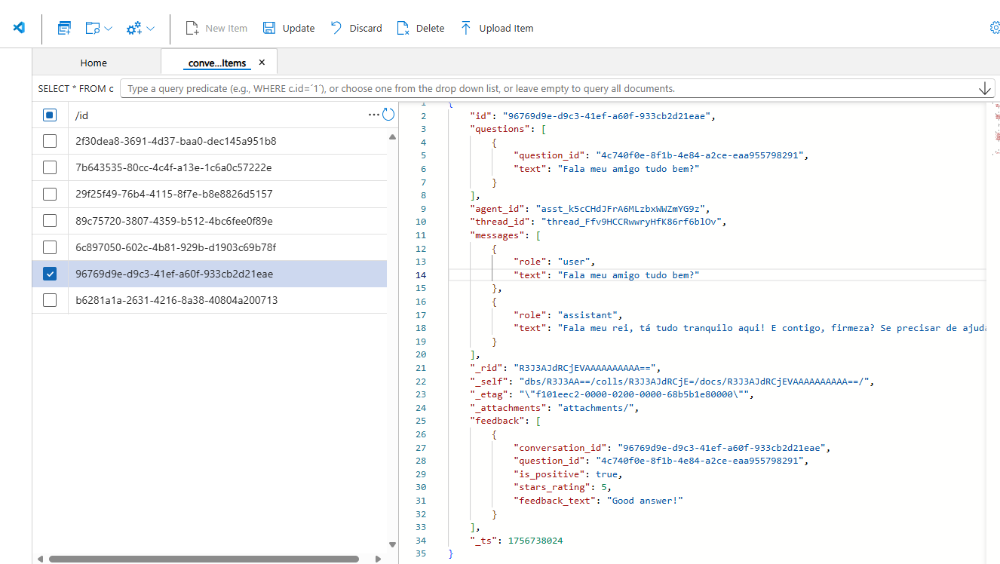
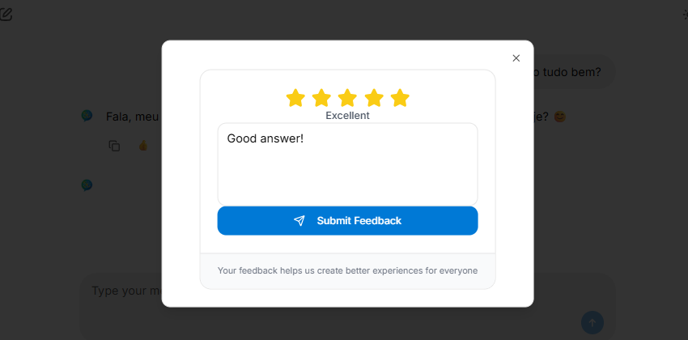
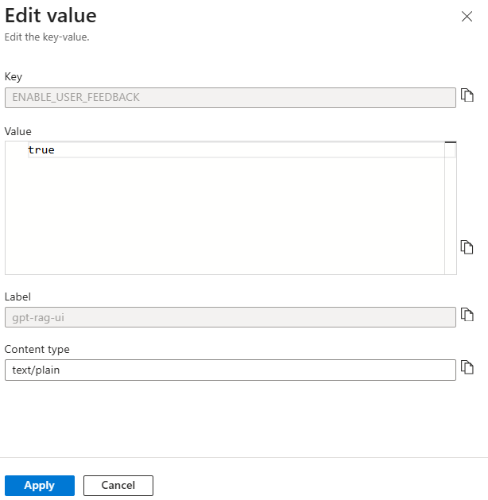
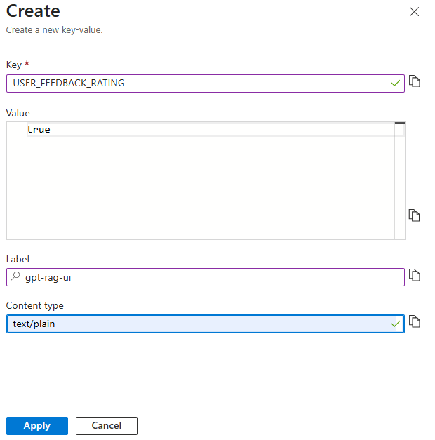

# Configuring User Feedback Loop

GPT-RAG includes a **User Feedback Loop** feature that lets users evaluate the assistant’s responses through the UI. Feedback—whether a simple thumbs up/down or a detailed rating with comments—is sent to the application backend, forwarded to the orchestrator for processing, and then stored in **Cosmos DB**. This data can be queried and analyzed to improve answer quality, track performance, and support continuous learning.

*User feedback stored in Cosmos DB*

By default, **basic feedback** (thumbs up/down) is enabled, while **feedback with ratings** (star rating and text comments) is disabled. Administrators can enable or disable these options through configuration in the **Azure App Configuration** store.

#### User Feedback with Rating

When enabled, users can provide a **star rating** and a free-text comment. This richer evaluation captures not only whether the response was useful but also **why** the user rated it that way.

*User providing rating and comment feedback*

#### Configuration in App Configuration

The behavior of the feedback loop is controlled by key-values in **Azure App Configuration**:

* **ENABLE\_USER\_FEEDBACK** → Default: `true`
  Controls whether the feedback feature is available at all.

 *Key to enable or disable user feedback globally*

* **USER\_FEEDBACK\_RATING** → Default: `false`
  Controls whether users can provide detailed feedback with ratings and comments.

 *Key to enable or disable detailed rating feedback*

#### Default Settings

* `ENABLE_USER_FEEDBACK = true`
* `USER_FEEDBACK_RATING = false`

This means feedback is collected by default, but **star ratings and comments** must be explicitly enabled by setting `USER_FEEDBACK_RATING` to `true`.
